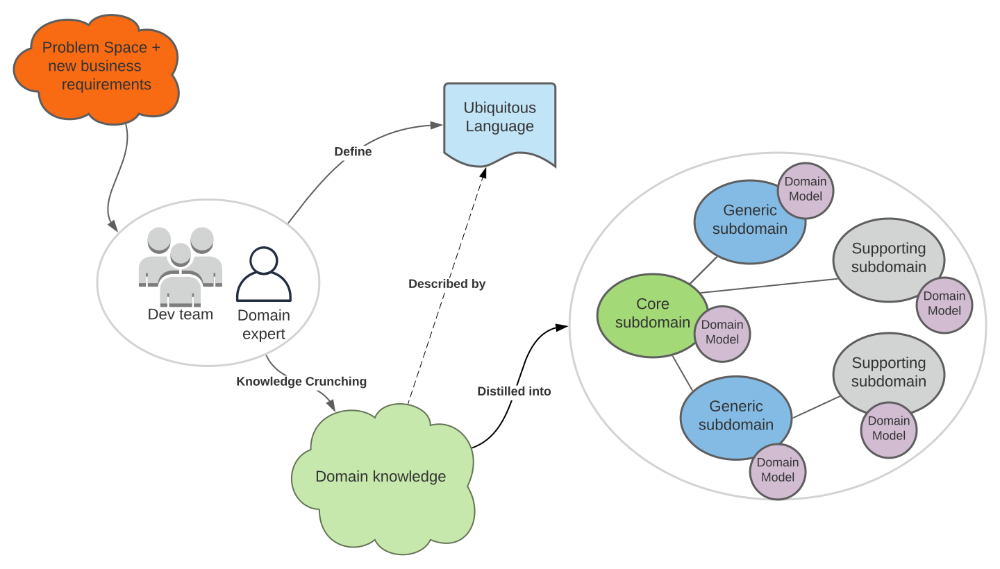

Domain Driven Design is a methodology that is aimed at managing complexity of problem domains, into 
suitably-sized and well-organised definitions of objects and business rules  that may be understood by 
both business stakeholders and technical staff for easier design of software. This is in-contrast to the
defined 'Big Ball of Mud' pattern (coined by Foote & Yolder), which describes haphazardly-structured, spaghetti-code 
that can easily-arise as code evolves over time with little design or standard constraints. 

Domain-driven design is aimed at promoting design quality via the following:

#### Using Strategic Patterns to:
* Distill the Problem Space; i.e. an organisation's business capabilities, to identify features 
  important to the business by:
  * Using a Shared/Ubiquitous Language (UL) to promote modelling collaboration and 'knowledge crunching'
  * Creating models to decompose and help solve domain problems, into Domains and Subdomains
* Producing a Solution Space to define **Bounded Contexts** within a problem Subdomain. _Note each Bounded Context may be considered as a candidate for defining 1 or more **Microservices**_
* Producing a **Context Map** that defines the relationships between bounded contexts.

eg (with credit to Millett):

Refer to [Strategic Patterns](ddd-strategic.md) for examples used with The Better Store

#### Using Tactical Patterns to:
* Create an effective Object-Oriented domain model
* Defining **Domain Entities** as objects within a system that have a unique identity and preferably behaviour 
(i.e. 'non-anaemic'). Value Objects and Aggregates are also defined here, as described later.
* Defining **Domain services**; to implement business behaviour that spans across multiple objects.
* Provide an overview of lifecycle patterns ie **Aggregates**, **Factories** and **Repositories**
* Illustrate emerging patterns of domain events and event sourcing
* _Note technical staff tend to be most-familiar with Tactical Patterns; effort on Strategic Patterns with involvement
  from domain experts is arguably considered the most valuable, for example to produce evolvable designs that may cater for future
  envisaged business use cases._

Refer to [Tactical Patterns](ddd-tactical.md) for examples used with The Better Store

