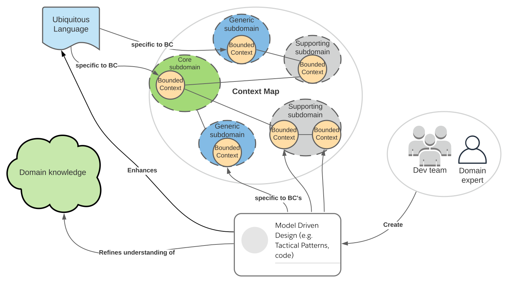

Domain Driven Design (DDD) is a methodology  initially defined in 2003 in Eric Evan’s popular and well-received book 
‘Domain-Driven Design: Tackling Complexity in the Heart of Software’ [1]. It is aimed at decomposing the complexity 
of a **Problem Space** (that is, a business's functional domain/capabilities that are requiring development) into a 
domain model comprised of one or more **Bounded Contexts**; a set of cohesive, decoupled, suitably-sized and 
well-organised definitions of objects and business rules that may be understood by both business stakeholders and 
technical staff, to offer easier interpretation and design of software. 
These Bounded Contexts define the problem's **Solution Space**.

While DDD predates the advent of microservices by almost 10 years, its goals and defined patterns for designing 
cohesive, decoupled and collaborative bounded contexts are strongly aligned with microservice architecture
goals, for implementing cohesive and decoupled services that realize advantages of change agility, resilience and scalability 
within cloud environments. 
As such, DDD has become a popular reference today when discussing microservice architectures within complex domains.

Domain-driven design is aimed at promoting design quality via the following methods:

#### A. Using Strategic Patterns to:
1. Distil the **Problem Space**, i.e. an organisation's business capabilities, to identify features important to the business by:
  * Using 'Knowledge Crunching' methods to extract relevant information and help identify and decompose 
  the problem space into separate manageable subdomains.
  * Defining a Shared/Ubiquitous Language (UL) for each subdomain that is understood by both business and technical stakeholders, 
which should subsequently be used for documentation and code artefacts (e.g. for the names of classes and their methods 
and attributes).
2. Produce a **Solution Space** comprising **Bounded Contexts** to demarcate and model solutions for identified subdomains.
3. Producing a **Context Map** that defines the relationships between bounded contexts.

For example (with credit to Millett & Tune [3]):

_Illustrating DDD Patterns for the Problem Space_

_Illustrating DDD Patterns for the corresponding Solution Space_

Refer to [Strategic Patterns](ddd-strategic.md) for examples used with The Better Store

#### B. Using Tactical Patterns to:
1. Create an effective Object-Oriented domain model for each Bounded Context, using defined patterns such as Entity, 
Aggregate, Value Object, Service, Factory and Repository.
2. Illustrate emerging patterns of _domain events_ and _event sourcing_.

Refer to [Tactical Patterns](ddd-tactical.md) for examples used with The Better Store

