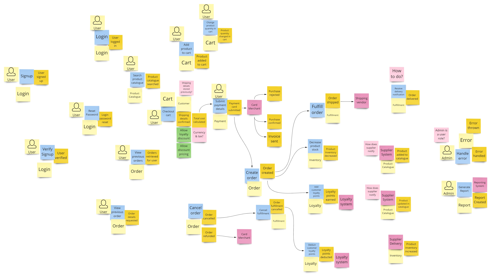
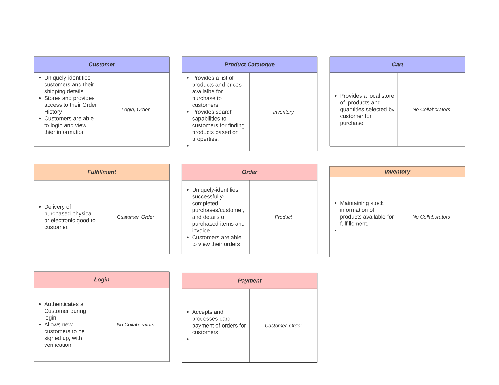
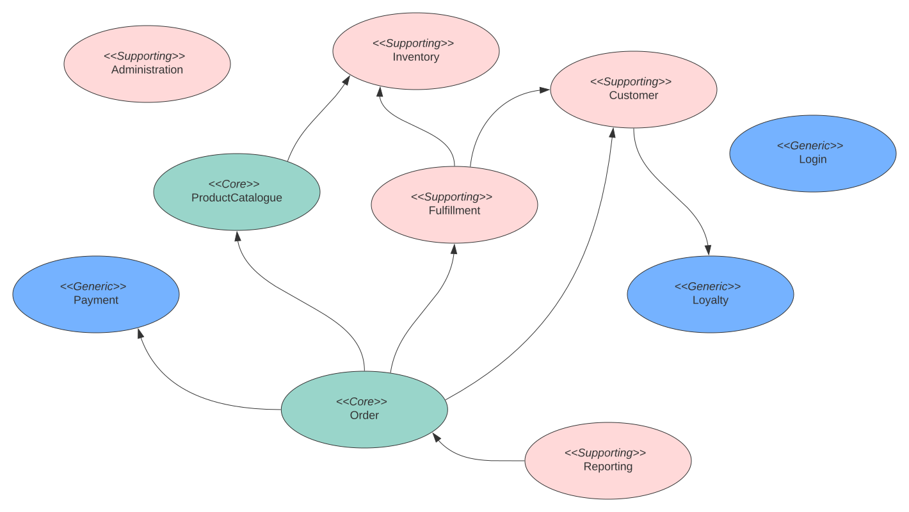
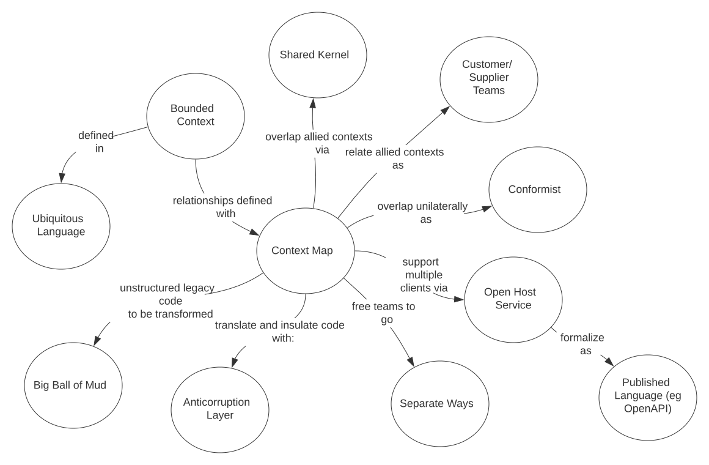
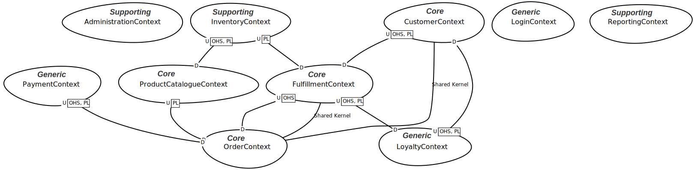

As described in the previous [Overview](ddd-overview.md), DDD Strategic Patterns are used to: 
1. Distill the **Problem Space** that defines the organisation's business capabilities, to identify and highlight
  its important features by:
   * Using 'Knowledge Crunching' methods to extract relevant information and help identify and decompose 
   the problem space into separate manageable business subdomains, with the idea that these can be more-easily 
   understood and maintained if owned by separate teams. The intent is that each team should require minimal knowledge of other
   subdomains that other teams are responsible for. This will be discussed further in the Integration Patterns section below.
   
   * Defining a Shared/Ubiquitous Language (UL) for each subdomain that is understood by both business and technical
   stakeholders, which should subsequently be used for documentation and code artefacts (e.g. for the names of classes and their
   methods and attributes).
   
2. Whereas the Problem Space of a business is generally similar for different organisations that are involved in the same
 business, it is how they implement their solutions; i.e. their **Solution Space** that will generally differ [(6)](../references.md). 
 DDD prescribes the design of **Bounded Contexts** to demarcate and model solutions for identified subdomains, and
 "Context Mapping" with Integration Patterns to describe the relationships between them. As will be described 
 later below, the choice of integration patterns to use will influence the degree of coupling between these, noting that we wish
 to maximise loose coupling for an agile and scalable microservice architecture.

Finally, it may be noted that each Bounded Context may be considered as a candidate for defining one or 
 more **Microservices**_; this will be discussed further in the [Tactical Patterns](../references.md) section.

## 1. Problem Space
As an initial step in the design of The Better Store, we would expect our business domain expert and development team 
to collaborate within 'Knowledge Crunching' sessions; using popular techniques such as 'Event Storming' for fast 
sharing and discussion od ideas for desired functional behaviour. Event Storming has been touted as having much success 
more recently for sharing ideas of system behaviour and scope between both technical and non-technical people [(4)](references.md).

The output of Event Storming workshops are highly-visual diagrams conveying envisaged business contexts and behaviours.
From here, main use cases may be chosen that would become part of the 'Core Domain' for implementation of a Minimal
Viable Product (MVP). More explicit specifications for these can then be defined using tools such as:

1. Behaviour-Driven Development (BDD) specifications to focus on the behaviour of the main use cases oriented around specific
scenarios.
2. Class Responsibility Collaborator (CRC) cards to define potential structural elements from these, and the 
interactions between them. 

The application of these techniques will be illustrated at a very high-level below for an MVP definition of The Better Store.
Further reading is recommended for those that wish to learn more of the techniques; the scope for each of these, in
particular Event Storming and BDD is large!

_Note: the methodologies chosen here have been selected as examples for The Better Store as a new application.
Other techniques would undoubtedly also come into play for other scenarios; for example exploring published
models for similar applications, or referencing existing documentation for refactoring or enhancement of 
a current application.
_ 

#### A. Identifying System Behaviour Using Event Storming
Alberto Brandolini first introduced this methodology in his book Introducing Event Storming[(3)](references.md), whereby
analysis of a business process involves bringing together the development team and the right business process expert(s) from 
applicable "knowledge silos" within the business as participants in collaboration workshops. Within the workshops,
participants are requested by the workshop mediator to use different colour-coded sticky notes to model a flow of 
domain events, commands and external systems over time (from left to right); i.e. _temporal modelling_ on a clear wall space.
Online collaboration tools such as [Miro](https://miro.com) are also available to support teams where participants 
are in remote locations.

Event storming is often performed in a number of phases as defined and controlled by the mediator as appropriate for the system 
and/or goal; for example for a high-level design of The Better Store we will derive these from Brandolini's 'Big Picture Workshop' 
configuration to have:

_Phase 1_. **Chaotic Exploration**
* All participants add Orange notes to represent expected domain events (verbs in the past tense), and lilac notes to represent questions or
questions or unknowns (specific discussions should be kept short at this time; our focus here is coverage).

_Phase 2_. **Timeline Enforcement**
* Rearrange events to restrict them to a single timeline. This should result in further discussions and 
help identify gaps or unknowns.

_Phase 3_. **Commands, People and Systems**
* Blue notes are added to represent commands (imperatives), which may be called by external users or systems to generate
the events.
* Pink notes are then added to represent external systems that may be used.
* Finally, yellow notes with a User icon are added to represent people that interact with the system.

_Phase 4_. **Explicit Walkthrough**
* Different narrators take the lead for describing the behaviour for different portions of the system, for 
further review by other participants.

_Phase 5_. **Identifying Aggregates** 
* We can use yellow notes to denote potential 'Aggregates'; that is, system entities that have their own identity id,
sub-elements and transactional lifecycle. An example is Order, which will be required to have its own unique id for storage
within a database, alongside its selected product items as attributes (which would also be persisted
when an order is created or updated in a data store).

_Phase 6_. **Problems and Opportunities**
* Additional time for participants to add further questions (lilac notes), or **opportunities** (green notes).

_Phase 7_. **Wrap up**
* Ensure photos of the board are taken (and notes are kept if hard to ready from photos), to allow its referencing
for analysis and modelling later.

The following provides an example output from a remotely-run (using Miro) Event Storming session for The Better Store. 

#### B. Defining Functional Behaviour With Behaviour Driven Development (BDD) Specifications
BDD is a software development process based on Test Driven Development (TDD), which focuses on defining
explicitly functional scenarios and required behaviour, using its own 'GWT' (Given, When, Then) specification 
language. This format is also intended to provide a language that is understood by both business and technical
stakeholders for defining requirements, oriented around user stories, or 'features'. Examples for "The Better Store" 
generated as BDD specifications may include:
   * [AddProductsToCart.feature](bdd/AddProductsToCart.feature.md)
   * [AdministerErrors.feature](bdd/AdministerErrors.feature.md)
   * [CheckoutProductsInCart.feature](bdd/CheckoutProductsInCart.feature.md)
   * [UserLogin.feature](bdd/UserLogin.feature.md)
   * [UserSignup.feature](bdd/UserSignup.feature.md)
   * [FulfillOrder.feature](bdd/FulfillOrder.feature.md)
   * [ManageOrder.feature](bdd/ManageOrder.feature.md)
   * [MaintainProductsInCart.feature](bdd/MaintainProductsInCart.feature.md)
   * [ViewOrderReports.feature](bdd/ViewOrderReports.feature.md)
   * [ViewProductCatalogue.feature](bdd/ViewProductCatalogue.feature.md)

Using this method of capturing requirements removes the ambiguity that traditional requirements documentation can
result in while also focusing on the domain language. The generation of these can also help with formulation of 
a subdomain's Ubiquitous Language ([2](../references.md)).

#### C. Defining Functional Components With Class Responsibility Collaborator (CRC) cards
CRC Card modelling is an object-oriented technique that involves identifying the main system actors; 
e.g. from the Aggregates first deduced during Event Storming or entities noted in the BDD specifications above, 
and representing these visually for easy collaboration on separate cards.
Each CRC card should capture the following:
     1. A class name, which represents a known concept within the domain and is easily-understood by business and technical 
     members (this will go into our Ubiquitous Language)
     2. Class responsibilities
     3. Associated classes. A class often does not have sufficient information to fulfill its responsibilities, and must
        _collaborate_ with other classes to complete their task. Such collaboration may be either: i. a request for 
        information from another class, or ii. a command to perform an action.

The following illustrates cards for our identified aggregates.

  

#### Distilling the problem space into subdomains
The above exercises; in particular Event Storming and CRC cards assist us with demarcating functional requirements 
into separate subdomains, identifying dependencies between them, and an initial Ubiquitous Language for each. 
As a final step in defining our problem space, we would like to further categorise these in
order of importance to our business. The outcome of this exercise is to prioritise functionality for development focus,
to ensure that tasks that provide the most competitive advantage receive the most attention.

###### Core Domain(s)
These cover the most important part of the business that provides its competitive advantage. Rather than identifying only one, 
for The Better Store we have identified multiple subdomains as core, being:

|SubDomain| Description                                                                                                             |
|:---|:------------------------------------------------------------------------------------------------------------------------|
|ProductCatalogue| Required for presenting available product information to online customers to choose                                     |
|Order| Critical component for managing product orders and payments                                                             |

###
###### Supporting Domains
These provide supporting functions to the core domains If possible, Commercial Off-The-Shelf (COTS) products should also be used if available.

|SubDomain| Description                                                                                                                               |
|:---|:------------------------------------------------------------------------------------------------------------------------------------------|
|Fulfillment| Critical component for sending order to the warehouse for arranging delivery, and critical for delivering digital goods |
|Customer| Required for managing customer information such as shipping details                                                     |
|Inventory| Provides stock manangement to the business. While important, manual processes are possible if this is not immediately implemented         |
|Administration| Provides error management and support features to technical staff                                                                         |
|Reporting| Provides reporting functionality to the business. Note these could be manually produced also, hence are not critical/core to the business |

###
###### Generic Domains
Generic subdomains provide common functionality that are not core to the business, and could also well-be 
provided by COTS software (again freeing-up developers to focus on the core areas).

|SubDomain| Description                                                                                                                                 |
|:---|:--------------------------------------------------------------------------------------------------------------------------------------------|
|Login| It is envisaged that AWS Cognito may be configured to provide authentication and authorisation features of users                            |
|Payment| Payment vendors such as Stripe will be used that also provide necessary security requirements such as PCI                                   |
|Loyalty| It is anticipated that loyalty management software may be avaliable; otherwise this feature is deemed lower priority for future development |

The following diagram summarises the subdomains identified for our problem space, and their dependencies.

## 2.  Solution Space
A Solution Space provides a model for realizing the needs of the requirements given in the Problem Space, for example by
 defining appropriate **Bounded Contexts** (BC's) for each subdomain to implement. Each bounded context is also provided with its own Ubiquitous
 Language; much of which should have been defined during analysis of the Problem Space for the belonging subdomains. In this way
 each bounded context is kept _cohesive_ to a specific functional area.

 The Solution Space also uses Context Mapping with Integration Patterns to define collaboration relationships between the bounded contexts. 
 Decoupled collaboration between bounded contexts is promoted, to reduce the requirement for development teams to have detailed 
 knowledge of other teams' implementations. 

### Context Mapping

#### First, introducing Integration Patterns; communications between Bounded Contexts

##### Symmetric Patterns

* Separate Ways; bounded contexts are independent with no relationships between them. Teams can work at their own pace.

* Partnership Pattern ;2 Bounded Contexts are mutually dependent on each-other; ie are tightly-coupled. Teams need to know the business models and UL of the other team. Changes need to be coordinated. An anti-pattern of MSA to move from.

* Shared Kernel; Move to demarcate shared models used between BC’s. eg as separate libraries and UL. This should be kept to a minimal amount of contexts

##### Asymmetric Patterns
Where 1 bounded context is dependent on another .The dependent is termed Downstream (D), the provider/host is terms Upstream (U). 
BC’s in D hence have knowledge of models in U BC’s (not the flow of information.

* Customer-Supplier Pattern; Upstream BC exposes models specifically for the needs of downstream BC; eg as a client/host relationship

* Conformist Pattern; Upstream BC exposes models with no regards to any downstream BC. The downstream BC conforms to the upstream BC models.

* Anti Corruption Layer Pattern; D is NOT conformist; an isolated transformation layer is used to protect the downstream BC from corruption; i.e. from using another domain’s model. The ACL only has the knowledge of models from U and D to perform necessary mappings from U’s model to downstream.

##### One-to-many Patterns

* Open-Host Service; the upstream provider/'Open Host Service' (OHS) offers common services to other BC’s. The downstream BC’s may choose to either conform or use an ACL.

* Published Language; The OHS provides a common language accepted by downstream. Denoted as OHS | PL.for Upstream in a context mapping diagram. eg an OpenAPI spec for hosted RestAPI’s.

_Note we want to avoid the 'Big Ball Of Mud'; this is the described anti-pattern which often results from unchecked growth of a monolith over time, where without practices code can become unstructured and very hard to extend and maintain._

Fig 2. A context map for The Better Store

### Next Steps: Creating a Model Driven Design
Completion of the Solution Space requires modelling for each of the bounded contexts; whereby Tactical Patterns come into play. We will
be drilling into these further for the realization of cohesive and decoupled Microservices for The Better Store in the next section.