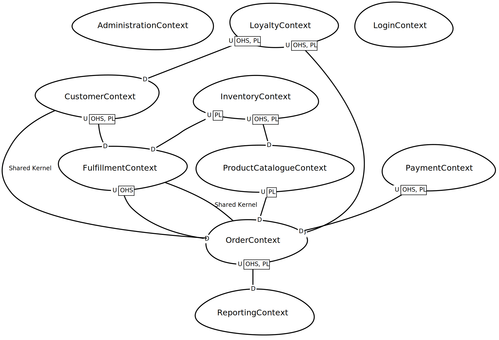

### Problem Space
As an initial step in the design of The Better Store, we would expect our business domain expert and development team 
to collaborate within 'Knowledge Crunching' sessions; using popular techniques such as 'brain storming' with
whiteboard sessions, or 'Event Storming' for fast sharing and discussing of ideas. 
Such sessions could  focus first on:

* Defining main use cases; e.g. those that would expect to become part of the 'Core Domain' for implementation of a 
Minimal Viable Product (MVP). _These could also be captured using BDD-based specifications_

* Identify the main system actors, and represent visually for easy collaboration as Class Responsibility Collaboration
  (CRC) cards; each of which captures the following:
  1. A class name, which represents a known concept within the domain and is easily-understood by business and technical 
  members (this will go into our Ubiquitous Language)
  2. Class responsibilities
  3. Associated classes

* Event Storming (a fun collaborative exercise involving a large board and many Post-It notes)!

Examples for "The Better Store" include:
* BDD Specifications
  * [AddProductsToCart.feature](bdd/AddProductsToCart.feature)
  * [CheckoutProductsInCart.feature](bdd/CheckoutProductsInCart.feature)
  * [CustomerLogin.feature](bdd/CustomerLogin.feature)
  * [CustomerSignup.feature](bdd/CustomerSignup.feature)
  * [FulfillOrder.feature.feature](bdd/FulfillOrder.feature.feature)
  * [MaintainProductsInCart.feature.feature](bdd/MaintainProductsInCart.feature.feature)
  * [ViewProductCatalogue.feature.feature](bdd/ViewProductCatalogue.feature.feature)

* Class Responsibilities
 

##### Distilling the problem space

###### Core Domain

###### Generic Domains

###### Supporting Domains

### Solution Space
#### Model Driven Design
A domain model

### Context Mapping

Fix 2. A context map for The Better Store

