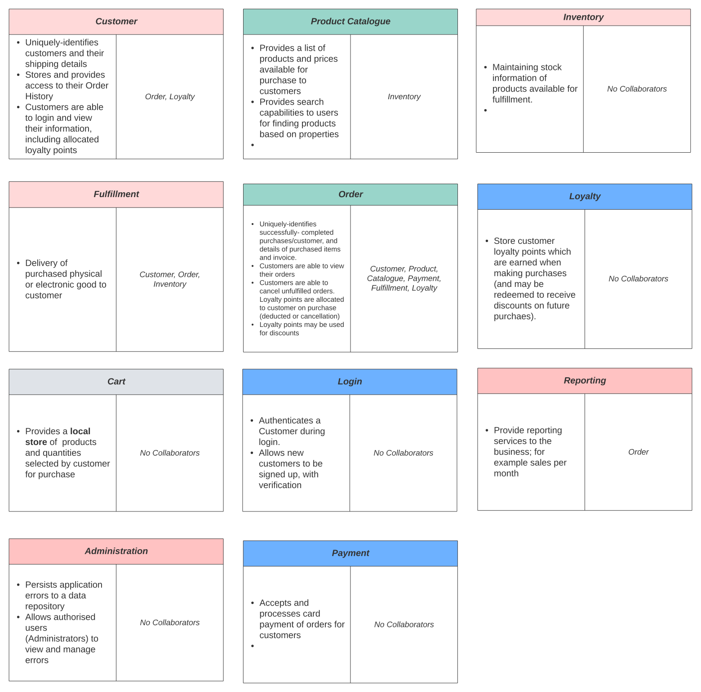

### Problem Space
As an initial step in the design of The Better Store, we would expect our business domain expert and development team 
to collaborate within 'Knowledge Crunching' sessions; using popular techniques such as 'brain storming' with
whiteboard sessions, or 'Event Storming' for fast sharing and discussing of ideas. We focus on main aspects below; 
for identifying main system actors/entities, their behaviours, and relationships between them.

1. Defining main use cases; e.g. those that would expect to become part of the 'Core Domain' for implementation of a 
Minimal Viable Product (MVP). _These could also be captured using BDD-based specifications_.

   Examples for "The Better Store" generated as BDD specifications include:
   * [AddProductsToCart.feature](bdd/AddProductsToCart.feature.md)
   * [AdministerErrors.feature](bdd/AdministerErrors.feature.md)
   * [CheckoutProductsInCart.feature](bdd/CheckoutProductsInCart.feature.md)
   * [UserLogin.feature](bdd/UserLogin.feature.md)
   * [UserSignup.feature](bdd/UserSignup.feature.md)
   * [FulfillOrder.feature](bdd/FulfillOrder.feature.md)
   * [ManageOrder.feature](bdd/ManageOrder.feature.md)
   * [MaintainProductsInCart.feature](bdd/MaintainProductsInCart.feature.md)
   * [ViewOrderReports.feature](bdd/ViewOrderReports.feature.md)
   * [ViewProductCatalogue.feature](bdd/ViewProductCatalogue.feature.md)

2. Identify the main system actors; eg from entities noted in the Use Case/BDD specifications above, 
and represent visually for easy collaboration as Class Responsibility Collaboration (CRC) cards.
Each of these should capture the following:
     1. A class name, which represents a known concept within the domain and is easily-understood by business and technical 
     members (this will go into our Ubiquitous Language)
     2. Class responsibilities
     3. Associated classes

e.g.

  

* Event Storming (a fun collaborative exercise involving a large board and many Post-It notes)!

##### Distilling the problem space

###### Core Domains
These cover the most important part of the business that provides its competitive advantage.
Identification of the core domain(s) here helps provide clarity of the software that should receive
the greatest development focus. Fot The Better Store these have been identified as:

|SubDomain|Description|
|:---|:---|
|ProductCatalogue|Required for presenting available product information to online customers to choose|
|Customer|Required for managing customer information such as shipping details|
|Order|Critical component for managing product orders and payments|
|Fulfillment|Important component for sending order to the warehouse for arranging delivery, and critical for delivering digital goods|

###
###### Supporting Domains
These provide supporting functions to the core domains If possible, COTS products should also be used if available.

|SubDomain|Description|
|:---|:---|
|Inventory|Provides stock manangement to the business. While important, manual processes are possible if this is not immediately implemented|
|Administration|Provides error management and support features to technical staff.|
|Reporting|Provides reporting functionality to the business. Note these could be manually produced also, and are not critical/core to the business|

###
###### Generic Domains
Generic subdomains provide common functionality that are not core to the business, and could also well-be 
provided by COTS software. It makes sense to free-up developers to focus on the core areas.

|SubDomain|Description|
|:---|:---|
|Login|It is envisaged that AWS Cognito may be configured to provide authentication and authorisation features of users |
|Payment|Payment vendors such as Stripe will be used that also provide necessary security requirements such as PCI|
|Loyalty|It is anticipated that Loyalty management software may be avaliable; otherise this feature is deemed lower priorityfor future development|

### Solution Space
#### Model Driven Design
A domain model

### Context Mapping

#### First, introducing Integration Patterns; communications between Bounded Contexts

##### Symmetric Patterns

* Separate Ways; bounded contexts are independent with no relationships between them. Teams can work at their own pace.

* Partnership Pattern ;2 Bounded Contexts are mutually dependent on each-other; ie are tightly-coupled. Teams need to know the business models and UL of the other team. Changes need to be coordinated. An anti-pattern of MSA to move from.

* Shared Kernel; Move to demarcate shared models used between BC’s. eg as separate libraries and UL. This should be kept to a minimal amount of contexts

##### Asymmetric Patterns
Where 1 bounded context is dependent on another .The dependent is termed Downstream (D), the provider/host is terms Upstream (U). 
BC’s in D hence have knowledge of models in U BC’s (not the flow of information.

* Customer-Supplier Pattern; Upstream BC exposes models specifically for the needs of downstream BC; eg as a client/host relationship

* Conformist Pattern; Upstream BC exposes models with no regards to any downstream BC. The downstream BC conforms to the upstream BC models.

* Anti Corruption Layer Pattern; D is NOT conformist; an isolated transformation layer is used to protect the downstream BC from corruption; i.e. from using another domain’s model. The ACL only has the knowledge of models from U and D to perform necessary mappings from U’s model to downstream.

##### One-to-many Patterns

* Open-Host Service; the upstream provider/'Open Host Service' (OHS) offers common services to other BC’s. The downstream BC’s may choose to either conform or use an ACL.

* Published Language; The OHS provides a common language accepted by downstream. Denoted as OHS | PL.for Upstream in a context mapping diagram. eg an OpenAPI spec for hosted RestAPI’s.

_Note we want to avoid the 'Big Ball Of Mud'; this is the described anti-pattern which often results from unchecked growth of a monolith over time, where without practices code can become unstructured and very hard to extend and maintain._

Fig 2. A context map for The Better Store

