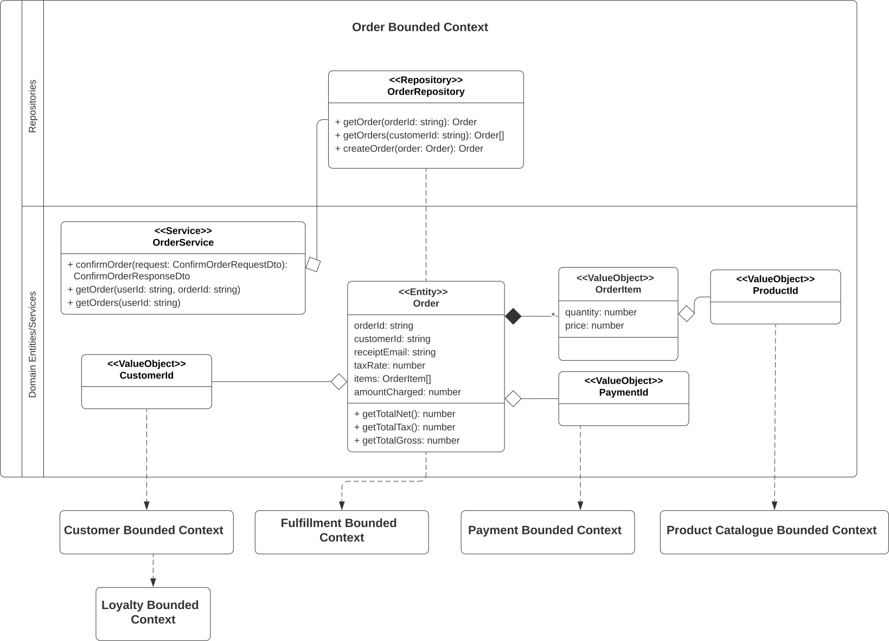

_NB: Content here is currently Work-in-Progress_

### Introducing Tactical Patterns
DDD tactical patterns, also known as 'model building blocks', are used to help define static models for complex bounded contexts.
The main patterns and their relationships are illustrated as:

| Pattern                           | Description                                                                                                                                                                                                                                                                                                                                                                                                                        |
|:----------------------------------|:-----------------------------------------------------------------------------------------------------------------------------------------------------------------------------------------------------------------------------------------------------------------------------------------------------------------------------------------------------------------------------------------------------------------------------------|
| Entity                            | Defines an object or Noun within a system _that has a unique and fixed identifier_ which can be used for retrieval or query. Being synonomous to Object-Oriented-Development objects, entities contain both attributes and behaviour/business logic (eg depoist/withdrawal methods in a bank account. *It is valid for Identifiers to span across bounded contexts.*                                                               |
| Value Objects                     | Defines an object within a system **that does not have a unique identifier**. They are immutable; typical examples include colours, dates/times and currency values                                                                                                                                                                                                                                                                |
| Aggregates                        | Defines a transactional boundary around one or more entities, where 1 entity is designated as the 'Aggregate Root', and its identifier is used to identify the entire aggregate. Aggregates operate to preserve data integrity of its contained entities; e.g. removing an Order may provide behaviour to remove a contained product, but then include **Invariants**/rules to recalculate totals and credit a customer's account. |
| Repositories                      | Manage persistence of objects into data stores                                                                                                                                                                                                                                                                                                                                                                                     
| Factories                         | Assist with the creation of new aggregates, where a constructor may not always be enough to deal with required complexity.                                                                                                                                                                                                                                                                                                         
| Domain & Application **Services** | Services are used to provide business functionailty that spans 2 or more entities; ie to provide behaviour that 1 entity cannot provide alone.                                                                                                                                                                                                                                                                                     |

### Example: Order Bounded Context
The Order bounded context was first introduced in [Strategic Patterns](ddd-strategic.md), as representing a 
core subdomain responsible for managing orders and payments within The Better Store, 
and is examined here to illustrate a service design using the above patterns.

Its DDD strategic design has included the following:

A. BDD Features
   1. PurchaseProductsInCartFeature; order-related scenarios include:
      PurchaseProductsInCartFeature; order-related scenarios include:
      * **@ConfirmOrder**; an Order consists of Products and their quantities in the cart, the Customer and associated email address, delivery address and shipping cost (of order contains physical products). The customer is directed to the payment system for completion here.
   2. ManageOrderFeature; order management scenarios including:
      * **@ViewOrder**; allows details of a previously-created order to be retrieved from the system.
      * **@ViewOrderHistory**; allows a list of previous orders created for a customer over the last 6 months to be retrieved.

B. Class Responsibility Collaboration

Combining these strategic design outputs with the described tactical patterns, an initial draft high-level class diagram may be constructed as below:

Note that while this provides us with a good start for an object-oriented design of how we may wish to implement 
an Order microservice using an object-oriented language, we need to at this point consider an appropriate Application Architecture 
for structuring a service, using layering principles to help ensure the application can be easily extended and 
maintained into the future, to avoid following the potential _Big Ball of Mud_ anti-pattern! 
For this we will be using the Onion Architecture, as described next.

    
### Application Architecture with Layering; introducing Onion Architecture!
A layered application architecture is a standard technique used by software developers and application architects to 
structure application source code into abstract layers (or tiers); for example by splitting code into separate 
subdirectories, modules and/or namespaces within the application’s code repository based on their general concerns; 
such as presentation, business domain logic, and data access. An example of this topology is illustrated below:

This also promotes a top-down dependency model, whereby higher layers can only communicate with the layer above them; for example logic within the presentation layer cannot directly obtain data from the database via the data access layer; such queries must be via calls to the business layer.

Advantages of a layered architecture for realizing Separation of Concerns include:

* Code complexity is reduced as is it organised within its area of concern. This allows application logic to be easier found and changed, with reduced risk of impacting other areas of the application. For example, making changes to the user interface may be performed with little or no change or regression testing being required for other application layers
* Such an architecture may even render it possible for an application’s entire user interface, or underlying database product to be replaced within an application, with little or no change being required to its business logic.

However, while the decomposition of an application into layers helps reduce its complexity, it operates at a high-level and does not necessarily include best practices for structuring code within the layers, or to align with artefact types modeled using Domain Driven Design. Each layer within a larger application can quickly become unwieldly and at risk of the ‘Big Ball of Mud’ as an application becomes larger if left unchecked without adoption of further decomposition and decoupling best practices and standards, such as Inversion of Control and SOLID by the development team. The Onion Architecture helps with the realization of these.

The **Onion Architecture** was first defined by Jeffrey Palermo [3] as a layered application dependency model, whereby outer layer components may be dependent on any of its lower-layer components, as illustrated in figure 6 below:

The architecture however exhibits the following differences to the n-tier layered architecture described as described earlier:

1. It promotes Inversion of Control (IoC) to provide loose or interchangeable coupling of components. In this respect, each layer/circle within its model encapsulates internal implementation details and exposes an interface for outer layers to consume.
2. The inner components are comprised of domain entities and services as defined by our DDD tactical patterns to provide core business functionality. Also included are abstract interfaces, for example data access methods, as illustrated in the Application Core in figure 7. Their concrete methods however are implemented at the outermost infrastructure layer, using IoC. This is because the technology implemented for a database, or other external dependency such as HTTP Rest endpoints or technology-specific adapter should be agnostic to business domain components, and be able to be substituted with another product if needed. They may also be substituted with a mock component for automated testing purposes.
3. Application services are often implemented to provide an additional decoupled layer above domain services, for example to:
- Serve as a proxy to requests to domain services, but with inclusion of additional functionality such as authentication/authorisation, or request/response object transformation, to satisfy system requirements. - Orchestrate calls to underlying domain services to meet specific use cases.
  The Infrastructure layer typically includes:
- API servers such as REST API gateways, which manage and propagate externally-received requests to underlying application and domain service components.
- Presentation components, such as a web user interface, which may be dependent on calls to application and domain services (as well as API’s as described above).
- Repository components for accessing data stores; e.g. relational or NoSQL databases.
- Adapters for accessing external dependencies; for example a REST HTTP client or AWS SQS client, both with bespoke security, logging and error handling requirements included.
- Automated unit or integration tests. These can include dependency injection configurations which mock external dependencies, to provide fast and consistent test results within an isolated environment.
  Details of IoC are out-of-scope of this article; further information of this and related SOLID principles which relate well to the technical implementation of The Better Store is well-described in R. Jansen’s web article: Implementing SOLID and the onion architecture in Node.js with TypeScript and InversifyJS [10]. The following class diagrams and sample code however provide an example of how InversifyJS may be used within our NodeJS+Typescript OrderService implementation to define interface bindings to concrete RestApi client class for our main application, and the same interface bindings to a mock Payment API client class for a corresponding automated test application.

A complete AWS Serverless implementation of the architecture using Node.js with Typescript and Invesify for Dependency Injection will be described in the future Part Six article, however the following screenshot provides a taster of what we expect to come, in terms of its code scaffolding. Its code is available to view at: https://github.com/TheBetterStore/tbs-app-order.

