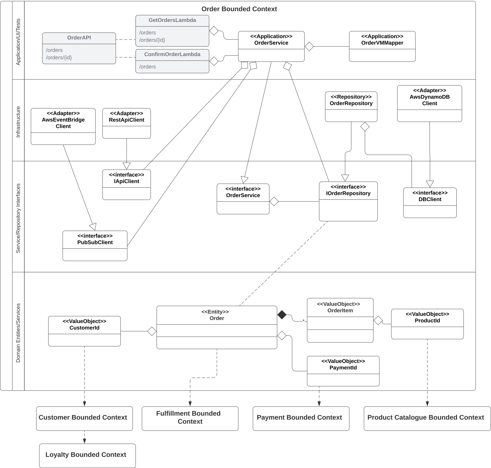

_NB: Content here is currently Work-in-Progress_

### Introducing Tactical Patterns
DDD tactical patterns, also known as 'model building blocks', are used to help define static models for complex bounded contexts.
The main patterns and their relationships are illustrated as:

| Pattern                           | Description                                                                                                                                                                                                                                                                                                                                                                                                                        |
|:----------------------------------|:-----------------------------------------------------------------------------------------------------------------------------------------------------------------------------------------------------------------------------------------------------------------------------------------------------------------------------------------------------------------------------------------------------------------------------------|
| Entity                            | Defines an object or Noun within a system _that has a unique and fixed identifier_ which can be used for retrieval or query. Being synonomous to Object-Oriented-Development objects, entities contain both attributes and behaviour/business logic (eg depoist/withdrawal methods in a bank account. *It is valid for Identifiers to span across bounded contexts.*                                                               |
| Value Objects                     | Defines an object within a system **that does not have a unique identifier**. They are immutable; typical examples include colours, dates/times and currency values                                                                                                                                                                                                                                                                |
| Aggregates                        | Defines a transactional boundary around one or more entities, where 1 entity is designated as the 'Aggregate Root', and its identifier is used to identify the entire aggregate. Aggregates operate to preserve data integrity of its contained entities; e.g. removing an Order may provide behaviour to remove a contained product, but then include **Invariants**/rules to recalculate totals and credit a customer's account. |
| Repositories                      | Manage persistence of objects into data stores                                                                                                                                                                                                                                                                                                                                                                                     
| Factories                         | Assist with the creation of new aggregates, where a constructor may not always be enough to deal with required complexity.                                                                                                                                                                                                                                                                                                         
| Domain & Application **Services** | Services are used to provide business functionailty that spans 2 or more entities; ie to provide behaviour that 1 entity cannot provide alone.                                                                                                                                                                                                                                                                                     |

In addition to these main patterns we also describe

| Pattern                          |Description|
|:---------------------------------|:---|
| Domain Events                    |These can be used to notify other system components when something happens; e.g. an order is cancelled; which should also be communicated across payment, fulfillment, and  loyalty domains.|
| Domain Model                     |As defined by Martin Fowler's 'Patterns of Enterprise Application Architecture', this is represented by an object-oriented model rather than being data-driven, as described further below in Domain Layers.|
| Anemic and Rich Models           |Anemic domain models are defined as an 'Anti-Pattern' by Fowler, whereby objects ar edefined with attributes but very little behaviour; ie to more resemble Data Transfer Objects (DTO's). The anaemic model rather promotes the addition of business into Services. The result is that rather than following Object Oriented Design principals, business logic and data transforamtions becomes procedural. Rich models in contrast promote the use of services for providing only logic that spans mutliple entities.|

Each of these are described in relation to The Better Store next.

### Example: Order Bounded Context
The Order bounded context was first introduced in [Strategic Patterns](ddd-strategic.md), as representing a 
core subdomain responsible for managing orders and payments within The Better Store, 
and is examined here to illustrate a service design using the above patterns.

Its DDD strategic design has included the following:

A. BDD Features
   1. PurchaseProductsInCartFeature; order-related scenarios include:
      PurchaseProductsInCartFeature; order-related scenarios include:
      * **@ConfirmOrder**; an Order consists of Products and their quantities in the cart, the Customer and associated email address, delivery address and shipping cost (of order contains physical products). The customer is directed to the payment system for completion here.
   2. ManageOrderFeature; order management scenarios including:
      * **@ViewOrder**; allows details of a previously-created order to be retrieved from the system.
      * **@ViewOrderHistory**; allows a list of previous orders created for a customer over the last 6 months to be retrieved.

B. Class Responsibility Collaboration

A draft class diagram has been constructed below to realize a design for the provided features using the tactical patterns:

Note that while this provides us with a good start for an object-oriented design of how we may wish to implement 
an Order microservice using an object-oriented language, we need to at this point consider an appropriate Application Architecture 
for structuring a service, using layering principles to help ensure the application can be easily extended and 
maintained into the future, to avoid following the potential _Big Ball of Mud_ anti-pattern! 
For this we will be using the Onion Architecture, as described next.

    
### Application Architecture with Layering; introducing Onion Architecture!
A layered application architecture is a popular technique used by software developers and application architects 
to structure application source code into separate locations; e.g. subdirectories or other code repositories, 
based on their function; for example presentation, business/domain logic and data access. Such layers of 
separation have traditionally been called 'tiers' in application architecture; and applications constructed from
the aforementioned layers may be termed '3-tier' or 'n-tier' applications. Each of the tiers will often change at 
different rates; separating source-code into the different layers of abstraction (or _Separation of Concerns_) is 
aimed at reducing complexity of the application by encapsulating similar functionality in the same place, while allowing 
for example user interface changes to be applied with low risk of impact to business or data access logic, and vice-versa.
Theoretically, if planned carefully such an architecture  may even render it possible for an application's entire user interface, or underlying 
database product to be replaced within an application, with little or no change being required to its business logic. In 
practice imperfections however can lead to at least minimal changes typically being needed for such a task. However, keeping
consideration for such substitution activities by methods of cohesive and loosely-coupled classes and components is vital
for enhanced extensibility and testability of code. We will be talking more about this with use of coding-to-interfaces and 
dependency injection next.

The Onion Architecture was first defined by Jeffrey Palermo (3), which is aimed at defining a layered dependency model whereby outer layers are dependent-upon but loosely-coupled to components within inner layers; with the adoption of Inversion of Control to provide loose or inter-changeable coupling. Inner-components should never be dependent on outer layers.
The inner components are comprised of domain entities and services as defined by our DDD tactical patterns to provide core business functionality. Application services are often implemented to provide an additional decoupled layer above domain services, for example to :
Serve as a proxy to requests to domain services, but with inclusion of additional functionality such as authentication/authorisation, or request/response object transformation, to satisfy system requirements .
Orchestrating calls to underlying domain services to meet specific use cases.

| Layer           | Description                                                                                                                                                                                                                                                                                                                                                                                                                                                                                                            |
|:----------------|:-----------------------------------------------------------------------------------------------------------------------------------------------------------------------------------------------------------------------------------------------------------------------------------------------------------------------------------------------------------------------------------------------------------------------------------------------------------------------------------------------------------------------|
| Application     | Application services are used to expose domain logic to the presentation layer via Data Transfer Objects (dto's), which may be also be known as View Models (VM's). In this way they also serve to isolate and protect the integrity of the domain model. Application services typically use both domain services and repositories to deal with external requests.                                                                                                                                                     |
| Infrastructure  | Infrastructure services provide technical capabilities to an application outside of the business logic; such as adapters and repositories for integrating with external systems and data stores, logging, messaging and authentication/authorisation.
| Domain Services | Domain services are used to perform domain operations and business rules that span across multiple entities ;i.e. those that o not naturally fit within a single domain entity. Unlike application services, domain services return domain objects.                                                                                                                                                                                                                                                                     
| Domain Model    | Represents aggregrates, entities and value objects which provide state and behaviour to model business logic for the system
| Application Core| The Application Core defines core interfaces that are requried across multiple layers to support dependency injection. 

Using the above constructs, our Order microservice application architecure may be further refiend as the following:

An AWS Serverless implementation of the architecture using Node.js with Typescript and Invesify for Dependency Injection will be described in the future Part Six article, however the following screenshot provides a taster of what we expect to come, in terms of its code scaffolding.

