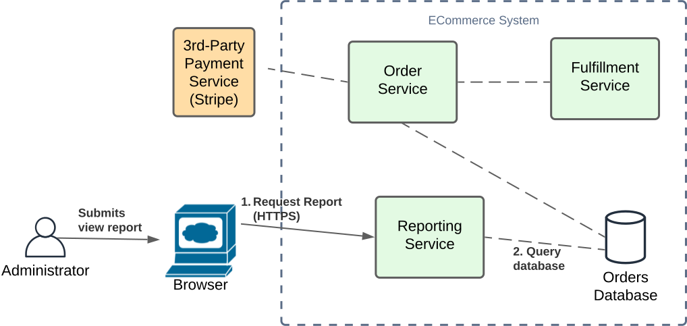

The previous sections have provided introductions to Domain Driven Design principles, and how they may be used for 
defining an appropriate Microservice Architecture for our sample 'The Better Store' cloud-native ECommerce system.
This section continues from the proposed DDD tactical design to formulate an implementation of our decomposed microservices, 
while describing and adopting popular cloud-native patterns to reap advantages that they provide.

The focus here will be defining an implementation which has the following features scope, as defined in the previous Strategic Patterns section:
* [CheckoutProductsInCart.feature](bdd/CheckoutProductsInCart.feature.md)
  * **Scenario 1**: OrderPurchased

    **When** I submit valid Card details

    **And** Payment is approved

    **Then** My order details with cart details will be stored in the Order Repository

    **And** I an electronic Receipt will be emailed to me

    **And** A shipping order is sent for Fulfillment

    **And** I will be directed to a Purchase Confirmation screen
  
* [FulfillOrder.feature](bdd/FulfillOrder.feature.md)
  * **Scenario 2**: FulfillPhysicalItemsInShippingOrder
    **Given** I have been presented with a pending shipping order following a purchase of products
  
    **When** 1 or more contained product(s) are to be fulfilled physically
  
    **Then** the product(s) will be sent to the dispatch team for packaging and courier
  
    **And** the Product status in the order will be marked as Processed
  
    **And** the Order will be marked as Processed if there are no more Pending items otherwise it will remain as Pending
    
A logical flow between services may be envisaged as the following:

Another feature of interest in scope is:

* [ViewOrderReports.feature](bdd/ViewOrderReports.feature.md)
  * **Scenario 3**: View report of completed orders
    **Given** I am a user with Administrator permissions

    **When** I select Reports/Compeleted Orders

    **Then** a list of the monthly sum of order net totals will be listed for the last 12 months

This logical flow is represented by the following:

So now that we have identified the resources and required interactions between them for implementing flows, we need to 
determine exactly how to implement these in a way that provides optimal scalability, resilience and performance while
considering cost, while using AWS as the platform of choice. Some questions that we could start ask ourselves while looking at the 
above high-level implementation designs:
1. What is the best website hosting technology to use, given the following requirements:
   1. Frontend being developed using modern-frameworks with a Single-Page-Application (SPA) static implementation, such as Angular.
   2. Best use of AWS services to provide a global-scale performant, cost-effective and resilient architecture
   3. Effective integration of user authentication and authorization at both the frontend and backend services. 
2. What is the best backend hosting technology to use for compute and data services that quickly scale on-demand, can be easily scaled
across regions for a global implementation, are resilient, provide cost optimization for both development and production environments in terms of compute and operational/maintenance costs.
3. What are the best methods for enabling communications between services and data stores which provide scalability, resilience and 
cost optimization that accommodate both development and production environments?
4. What are the best methods for managing transactions and errors?

For answering these questions, we will consider the following:
1. Microservice Architecture patterns. A great resource for referencing popular Microservice Architecture patterns has been published by Chris Richardson at, 
https://microservices.io/, which he illustrates as below:

2. Communication Patterns

3. Error Handling

4. Available AWS Services

## 1. Microservice Architecture Patterns

Key patterns that we will be exploring further include:

##### Application Patterns

| **Pattern**            | Description                                                                                                                                                                                                                                                                                                                                                                                                                                                                                                                             | Potential AWS Services |
|:-----------------------|:----------------------------------------------------------------------------------------------------------------------------------------------------------------------------------------------------------------------------------------------------------------------------------------------------------------------------------------------------------------------------------------------------------------------------------------------------------------------------------------------------------------------------------------|------------------------|
| _Decomposition_        |                                                                                                                                                                                                                                                                                                                                                                                                                                                                                                                                         | N/A                    |
| Decompose by subdomain | As per our previous sections, we may use Domain Driven Design to formulate appropriate decomposition of services to business capabilities or _subdomains_. We will focus on the Order, Fulfillment and Reporting domains for the above example.                                                                                                                                                                                                                                                                                         | N/A                    |
| Self-contained Service | Services own and define all of their dependencies such as data storage, security resources etc; such that they can be deployed quickly and independently across environments. This includes for example having their own security roles, firewall definitions, databases (see below), SSL certificates and domain records defined; external/shared dependencies are kept to a minimum; such as the VPC in which they reside.                                                                                                            | N/A                    |
| Service per team       | As each service is decomposed to a specific business subdomain, they should be allocated ownership to a single business product team that has ownership and is responsible for that subdomain, for current and future maintenance and releases.                                                                                                                                                                                                                                                                                         | N/A                    |
| _Data Patterns_        |                                                                                                                                                                                                                                                                                                                                                                                                                                                                                                                                         | N/A                    |
| Database per Service   | Implementing a database specific to a service helps promote system agility via cohesion and decoupling of services, and minimising their external dependencies. This is in-contrast to implementing a 'shared database', which while may provide a simpler system design including for transaction management and defining wider data relationships, change agility becomes reduced while database changes may impact all connected services.                                                                                           | RDS, DynamoDB (NoSQL)  |
| API Composition        | While microservices serve a specific subdomain for sending, receiving and processing of data, it is very common that clients may wish to query data that span multiple related services; e.g. both Order and Product services to provide inventory details of an order. API's may by created to serve a client, by implementing endpoints (e.g. 'GET /orderdetails' that can span multiple services and aggregate the results to return to the client. This greatly reduces the complexity and domain knowledge required by the client. | API Gateway            |
| CQRS                   | To promote scalability and resilience of a service's communications with a database, the Command and Query Responsibility Segregation is promoted, whereby writing of data to a database is performed separately and asynchronously (using 'eventual consistency') from synchronous read operations to the database. This will be described in further depth later.                                                                                                                                                                     |                        |
| Saga                   | Methodology that allows a distributed data transaction spanning multiple databases (or other data stores) to be rolled-back via compensatory actions. Note this becomes a necessary complexity for microservice architectures when a shared database is not used, in favour of agility.                                                                                                                                                                                                                                                 |                        |

##### Application Infrastructure Patterns

| **Pattern**                                     | Description                                                                                                                                                                                                                                                                                                                            | Potential AWS Services                                                                               |
|:------------------------------------------------|:---------------------------------------------------------------------------------------------------------------------------------------------------------------------------------------------------------------------------------------------------------------------------------------------------------------------------------------|------------------------------------------------------------------------------------------------------|
| _Cross-cutting concerns_                        |                                                                                                                                                                                                                                                                                                                                        |                                                                                                      |
| Externalized configuration                      |                                                                                                                                                                                                                                                                                                                                        | AWS SSM ParameterStore, AWS SecretsManager                                                           |
| _Communication Style_                           |                                                                                                                                                                                                                                                                                                                                        |                                                                                                      |
| Messaging (asynchronous)                        | A message channel is used by a service for sending messages to a destination, where an immediate response is not required. This pattern provides system resilience, by catering for cases where a destination system may be slow to response or temporarily unavailable. Examples include Email, and messages queues.                  | AWS SNS, AWS SQS, AWS EventBridge                                                                    |
| Remote Procedure Invocation (RPC) (synchronous) | Describes calls from a service to a destination where an immediate response is expected. Examples include HTTP(S) invocations.                                                                                                                                                                                                         | AWS SDK                                                                                              |
 | Idempotent Consumer                            | Describes how services should be able to handle receiving duplicate requests without causing side-effect to the system. This is particulary-important to cater for "At-Least-Once Delivery" of some message transport resources such as SQS to target services, and in cases where requests may need to be replayed for error handling |  
| _Reliability_                                   |                                                                                                                                                                                                                                                                                                                                        |                                                                                                      |
| Circuit Breaker                                 | A service proxy that stops sending requests to a service when an error threshold is reached; to help prevent a single service failure from impacting the remainder of the system                                                                                                                                                       |                                                                                                      |
| _Observability_                                 |                                                                                                                                                                                                                                                                                                                                        |                                                                                                      |
| Logging                                         |                                                                                                                                                                                                                                                                                                                                        | AWS Cloudwatch                                                                                       |
| Metrics                                         |                                                                                                                                                                                                                                                                                                                                        | AWS Cloudwatch                                                                                       |
| Distributed tracing                             |                                                                                                                                                                                                                                                                                                                                        | AWS x-ray                                                                                            |
| Health check API                                |                                                                                                                                                                                                                                                                                                                                        | AWS Cloudwatch alarms, healthcheck endpoint support e.g. Route53, Load Balancers, Autoscaling groups |

##### Infrastructure Patterns

| **Pattern**           | Description                                                                                                                                                                                                                                                                                                | Potential AWS Services                                                   |
|:----------------------|:-----------------------------------------------------------------------------------------------------------------------------------------------------------------------------------------------------------------------------------------------------------------------------------------------------------|--------------------------------------------------------------------------|
| Service per VM        | Each service/microservice is deployed to its own virtual machine. Horizontal scaling of the service may be realized by spawning new instances of VM's containing the application. Note scaliing can be slow, as initializing a VM requires bootstrapping of its underlying OS and infrastructure services. | AWS EC2                                                                  |
| Serverless deployment | The hosts and OS of services/microservices are abstracted away from the implementer, and the cloud provider assumes responsibility for managing these. Typically the cloud customer simply specifies the CPU and storage units tha are required, and costs ar ebased on these and time.                    | AWS Lambda (Function as a Service), AWS ECS (Fargate), AWS EKS (Fargate) |
| Service per container | Each service/microservice is deployed to its own docker container.  Horizontal scaling of the service may be realized by spawning new containers containing the application on a machine. In contrast to VM-based scaling, container scaling is typically fast.                                            | AWS ECS, AWS EKS                                                         |

