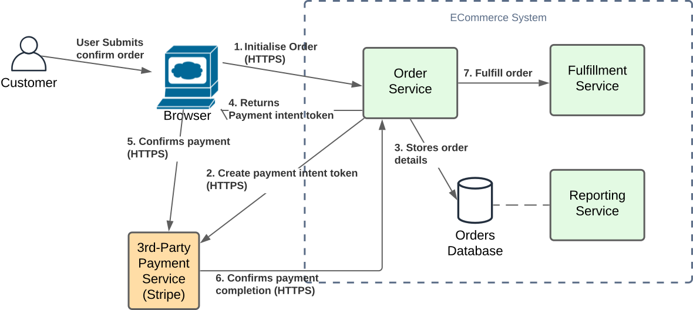

The previous sections have provided introductions to Domain Driven Design principles, and how they may be used for 
defining an appropriate Microservice Architecture for our sample 'The Better Store' cloud-native ECommerce system.
This section continues from the proposed DDD tactical design to formulate an implementation of our decomposed microservices, 
while describing and adopting popular cloud-native patterns to reap advantages that they provide.

The focus here will be defining an implementation which has the following features scope, as defined in the previous Strategic Patterns section:
* [CheckoutProductsInCart.feature](./../1-domain-driven-design/bdd/CheckoutProductsInCart.feature.md)
  * **Scenario 1**: OrderPurchased

    **When** I submit valid Card details

    **And** Payment is approved

    **Then** My order details with cart details will be stored in the Order Repository

    **And** The order details will be eventually persisted to the reporting database

    **And** An electronic Receipt will be emailed to me

    **And** A shipping order is sent for Fulfillment

    **And** I will be directed back to the store's home page, with a notice confirming the order number.

This logical flow is represented by the following:

*Figure 1: Logical flow representing completion of the Order Purchased scenario.*

So now that we have identified the resources and required interactions between them for implementing flows, we need to
determine exactly how to implement these in a way that provides optimal scalability, resilience and performance while
considering cost with AWS as the platform of choice. Some questions that we can start asking ourselves while looking at the
above high-level implementation designs are:
1. What is the best backend hosting technology to use for compute and data services that quickly scale on-demand, can be easily scaled
   across regions for a global implementation, are resilient, provide cost optimization for both development and production environments in terms of compute and operational/maintenance costs.
2. What are the best methods for enabling communications between services and data stores which provide scalability, resilience and
   cost optimization that accommodate both development and production environments?
3. What are the best methods for managing transactions and errors?

A number of Microservice Patterns have been published which are aimed at address these and other questions, and we will look at these next.

Next: [Microservice Architecture Patterns:](msa-architecture-patterns.md)
