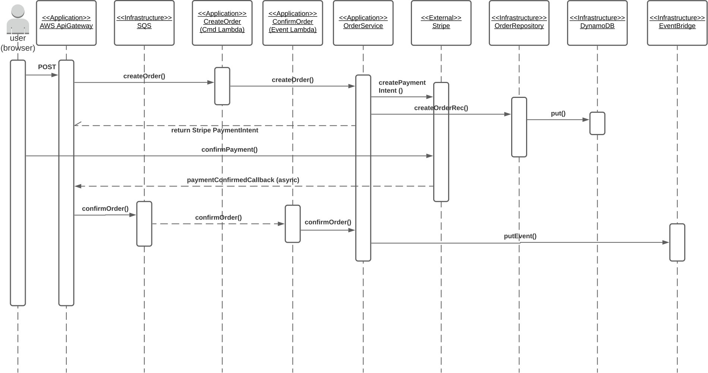
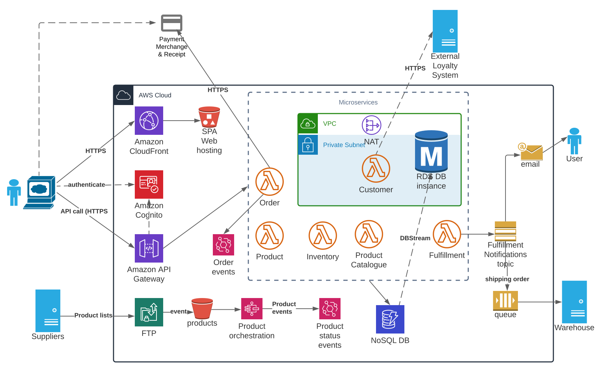

Coming soon... how the DDD implementation may be realized within an AWS Serverless (predominantly) architecture.

#### Patterns to note:

##### Application Patterns
* Domain Driven Design/Decomposition by business capability
* Self-contained/independent, cohesive and decoupled services
* Database per service
* Event driven + eventual consistency
* Data consistency; sagas, aggregates and event sourcing
* Event-driven
* Orchestration vs Choreography
* CQRS
* Monitoring; application instrumentation with metrics and logging

#####CQRS - Command Pattern

##### Application Infrastructure Patterns
* MSA
* Service Template & microservice chassis
* Access Token
* Communication stlyes (e.g. messaging (queue or pub/sub), RPC)
* Healthchecks + resiliency (HA and recovery)
* Circuit breakers

##### Infrastructure Patterns
* Serverless Deployment
* API Gateway
* Backends for frontends

Also with reference to the AWS Well Architected Framework and its underlying pillars concerning:
* Security
* Operational Excellence
* Reliability
* Performance
* Cost Optimization
* Sustainability

### Illustrating a perceived target architecture

