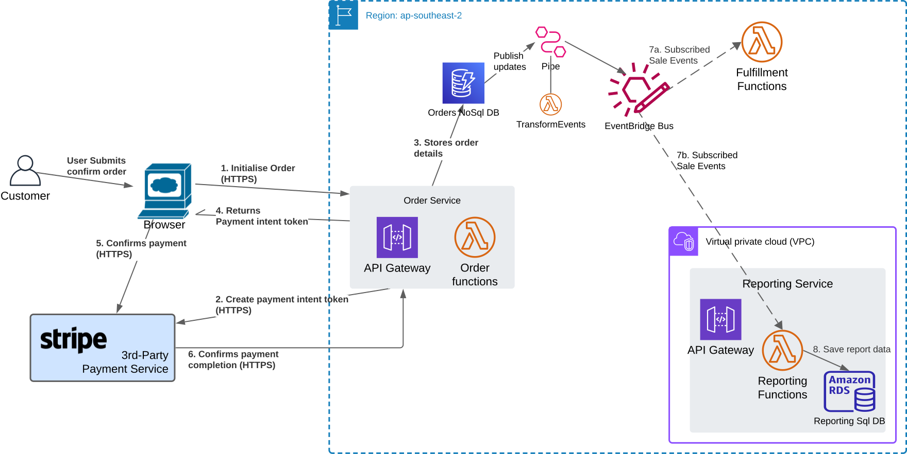
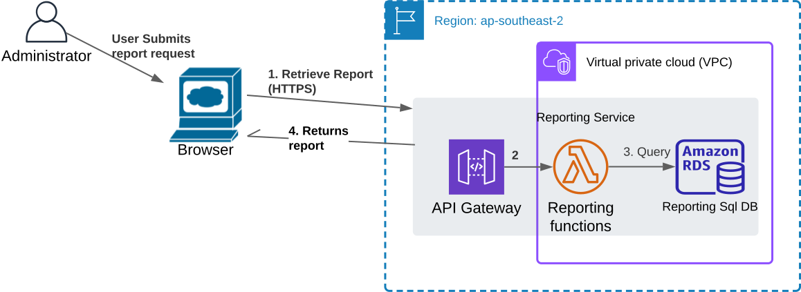
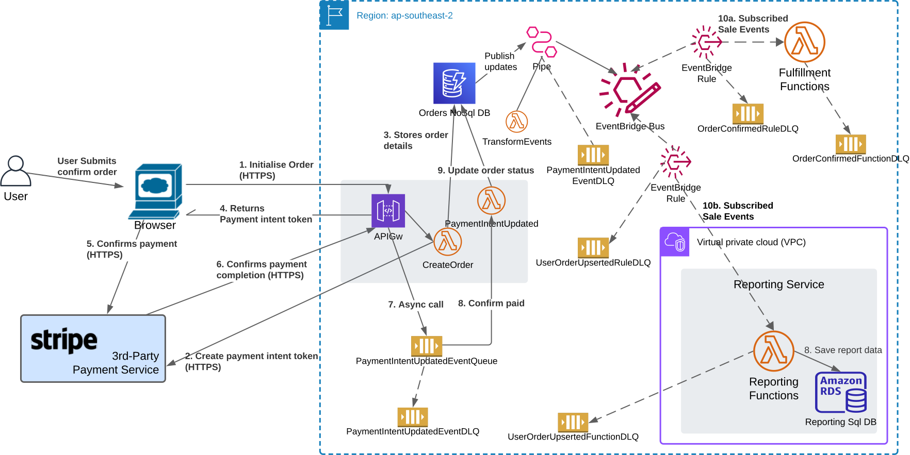

Coming soon... how the DDD implementation may be realized within an AWS Serverless (predominantly) architecture.

### 1. Confirm Order

### 2. Fulfill Order

### 3. Illustrating the overall architecture discussed

