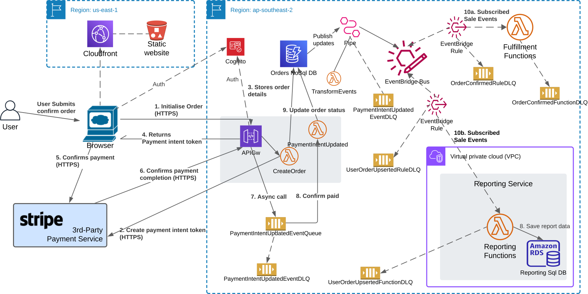

On consideration of the microservice patterns and candidate AWS services for their implementation, we conclude here in defining an implementation view, as illustrated below:

Decisions made for this architecture include:

1. Order, fulfilment and reporting services will be implemented as separate decoupled AWS microservices; each of which will be defined as separate AWS Cloudformation 
stack instances (tbs-app-order-prod, tbs-app-reports-prod, tbs-app-fulfilment-prod) in their own GitHub repositories, matching the stack names. 
This aligns well to the Decompose by Subdomain and Self Contained Service patterns.

2. The Database per Service pattern will be used such that tbs-app-order and tbs-app-reports services have their own database that is best-suited for their use-case.
The tbs-app-order service will implement DynamoDB as a highly-scalable and potentially global database that can accommodate high traffic volumes, where structured data and complex query capabilities are not required. The tbs-app-reports database will implement AWS Aurora Serverless v2, to subscribe to batched order confirmation updates, and allow these to be stored in a structured manner to allow complex queries for monthly reporting. As its traffic volumes are expected to be low and immediate responses are not required by clients (cold-starts of the dabase can be accommodated), scaling down to 0 CPU will be used for cost optimization. Finally, it is expected that running of queries can target the database’s read-only endpoint, to not impact writing to the database (though again this is probably not required for its expected traffic).
3. Inter-service communications will be asynchronous using messaging where possible, using primarily AWS EventBridge. AWS EventBridge offers similar capabilities to SNS for implementing the publish/subscribe pattern; it is a little bit slower which is not deemed so important to us for asynchronous communications, as it has advantages over SNS including more integration options, content-based subscriptions (i.e. subscribers can select to receive requests based on their content), and event storing (although this and event sourcing is not considered further here; it has its own complexities). SQS is used for guaranteed message delivery, where it is integrated with API Gateway to receive payment confirmation messages from the payment system (Stripe). In this way our webhook that we provide Stripe to invoke has very high availability; success responses will always be returned to Stripe as messages are placed on the queue for processing.
4. Aysynchronous services will implement the Idempotent Consumer pattern, to support Guaranteed At Least Once delivery properties of SQS and EventBridge, and the automated retry ( 2 times) behaviour of asynchronously-triggered AWS Lambda functions if they throw an error. Dead Letter Queues (SQS) will be configured for SQS queues, EventBridge and Lambda functions where appropriate, to ensure that for Lambdas; errored requests are not lost, and other services such as EventBridge, that retries do not continue forever!
5. Synchronous messaging via Remote Procedure Invocation will be implemented as RESTful API’s using API Gateway. Examples of its use include requests from the client website to retrieve and post data, where the client is dependent on inforamtion returned in the response.
6. AWS Cloudwatch will be used for monitoring metrics and logs of services and their associated resources, and providing monitoring dashboards and alarm capabilities. AWS X-ray will be used for distributed tracing of requests received.
Note other services such as OpenSearch and Managed Grafana are also available and may provide greater capabilities; Cloudwach has been chosen due to its simplicity for implementation while providing sufficient capabilities at low cost for our needs.
7. Serverless resources will be used where possible for our implementations, for reduced maintentance that would other be required for managing and patching servers, its generally-faster horizontal scalability and use of the Pay As You Go model which is generally favourable, especially for non-production systems! AWS Lambda is currently used to provide all compute functionality for The Better Store, while all of its request processing workloads are small and of very short duration (i.e. < 10 seconds, where AWS Lambda offers request processing for durations of up to 15 minutes).

To conclude, sample code (as Cloudformation templates and NodeJS implementations) for the services described here and other supporting stacks may be viewed on GitHub.
