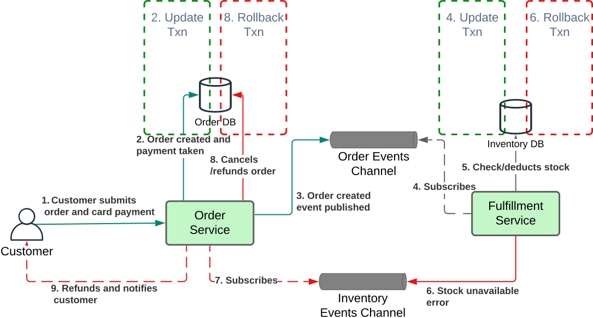

A number of patterns and best practices have been defined for microservice architectures; however Chris Richardson
provides a great overview and illustration of these at his website https://microservices.io/. A cut-down version of this to illustrate those considered for The Better Store are shown below:

_Figure 1. A summary of Microservice Patterns, highlighting key patterns for discussion with The Better Store in yellow._

A description of those used and why by The Better Store are described below.

## Application Patterns
### Decomposition
**A. Decompose By Subdomain:** describes how Domain Driven Design may be used to decompose a business's domain into decoupled subdomains or *Bounded Contexts*, each of which may be considered as a candidate for a microservice implementation. This topic has been the focus of our previous articles in this series.  

**B. Self Contained Service:** describes how services within an application are decoupled and can be updated and deployed with minimal risk of impacting other services. It also means services ideally should not synchronously call other services, or resources that they do not own such as shared databases; as in doing so reduces the system's availability and increases risk of release issues.
Consider for example the following alternative implementations for order fulfilment requests upon receiving payment confirmation from a card merchant. The first illustrates tight coupling between Order and Fulfillment services and use of a shared database. In this topology, changes to either of the Order or Fulfilment services, or the shared database, risk impacting request processing, 
and consequently customers not receiving their items as expected if not appropriately remediated. Side effects can also include:
1. Unexpected cloud usage charges; for example an issue causing a request to wait and consequently time out for a downstream service call will also impact its upstream requesting services.
2. Larger system availability issues due to exhausted resources (for example AWS Lambda concurrency, or database connections) if requests are not able to complete.
3. Potential issues in error handling when errors are returned to the payment and receipt system, which would need to be considered.

*Figure 2. Illustrating tight coupling between Order and Fulfilment services and use of a shared database.*

An alternative, decoupled solution and more resilient is shown below, noting that the client does not require data to be returned in a response; its calls may be made asynchronously. This solution offers the following:
1. Confirm Payment calls from the Payment & Receipt system are placed on a queue with 'Guaranteed At Least Once' delivery; and a successful response is ALWAYS returned to it. The client just needs to know that the message has been delivered successfully.
2. Both the Order and Fulfilment service receive requests asynchronously; it does not matter if they are not currently running, the messages will wait for them until they are next available.
3. If either service fails in processing a request, processing may be configured to retry for a set number of times, after-which they may be placed on a "Dead Letter Queue" for appropriate error remediation.
4. Both Order and Fulfilment services in this way are effectively decoupled, including having their own databases, such that an error introduced to one service should minimise impact for the other.

*Figure 3. An alternative decoupled solution*

A further note for the Better Store, this pattern has also been taken to describe how each service should own and define all of their application and infrastructure dependencies such as data storage, security resources etc; such that they can be deployed quickly and independently across environments. This includes for example having their own security roles, firewall definitions, databases (see below), SSL certificates and domain records defined; external/shared dependencies are kept to a minimum; such as the VPC in which they reside.
In the next DevSecOps section, *Infrastructure as Code (IaC)* using AWS Cloudformation will be described, for the creation of fully-encapsulated Cloudformation stacks which may be used to deploy instances of independent microservices, including resources that they require.

The example below illustrates the Order Cloudformation stack, which defines all of its required resources, and shared infrastructure stacks that it depends on.

_Figure 4: The Order Service encapsulated for deployment as a self-contained AWS Cloudformation stack._

To conclude this section on Self Contained Services, we can name some canidate AWS services for implementing the resources described:

**_Candidate AWS Services:_**
1. Guaranteed at-least-once queueing: SQS
2. Dead Letter Queues: SQS
3. Asynchronous messaging between services ("Remote Procedure Invocation/RPI"): SNS, EventBridge, DynamoDB Streams
4. Data stores: DynamoDB, RDS/RDS Aurora
5. Self-contained IaC: Cloudformation
6. Compute processing for processes of short duration, with fast scaling capabilities: Lambda

### Application Architecture

**C. Monolithic:** where an application is built and deployed from a single source code repository. This may have advantages for smaller applications and startups while source code is new and small, while offering reduced complexity. However, its continued growth over time without checks can yield a system that is harder
to change, scale and deploy, in a phenomenon coined the 'Big Ball of Mud'.

**D. MSA:** as already discussed, is focused on change agility when decomposing applications into multiple services. It cares less about code reuse in contrast to earlier architectures; it may be that duplicate code can sometimes exist between services, but this does allow such code to be modified if required in an application, knowing that other applications will not be affected as a result.

### Database Architecture

**E. Database per Service:** is another decoupling approach recommended for microservices. Traditional relational databases can grow large to support data models shared by multiple services, while they also enforce relational constraints and atomic transactions across tables to maintain data integrity. 
Imposing the database/service pattern implies the following:
1. The database is split into objects specific for each microservice, which means breaking relational constraints and ACID transaction support otherwise provided.
2. The application's architecture needs to be refactored to cater for the loss of these constraints to preserve data integrity. Patterns that may assist include 'Aggregate', 'Saga', and 'Idempotent Consumer', which are introduced below.

Advantages of the Database per Service again is *change agility*; any changes that may be required to a database should generally only impact its owning microservice. This greatly-reduces the risk of issues and the amount of regression testing
that may otherwise be required when making changes. Furthermore, each service is free to use a database technology that is most suitable for their needs (aka _polyglot persistence_), for example:

* The Order microservice is expected to use AWS DynamoDB, a serverless NoSQL database which scales well for high-demand, and is capable of replicating data across regions for potential future global scalability of the application.
* The Reports microservice is expected to use AWS Aurora Serverless, to receive orders in batches, which supports complex relational queries using SQL to provide overnight reports. Its serverless nature is expected to provide cost optimisation for its low intended traffic, while any cold-starts in activity will not impact users.

### Data Consistency

**F. Saga:** is a pattern that addresses the problem of how to manage business transactions that span multiple services and/or databases, for example when implementing the Database per Service pattern described above, and including a distributed transaction e.g. via a 2-phase-commit is either too complex or not possible for error handling. It describes
a process whereby such transactions are implemented as a sequence of partial transactions against each of the participant databases. If any single step of the transaction fails, then previous changes are to be rolled-back by running copensating transactions in the reverse order.

An example of a choreography-based saga is given below (where system behaviour is asynchronously event-driven):

_Figure 5: Saga pattern illustrating compensating actions to roll-back a transaction._

## Application Infrastructure Patterns

### Communication Styles:
**G. Remote Procedure Invocations (RPI)** refers to the use of standard synchronous request/reply protocols for inter-service communications, for example via REST, gRPC. These have advantages over 
Remote Procedure Calls (RPC's) between services, which are dependent on a specific programming language being used between client and server; such as an SDK call between a NodeJS application and AWS's NodeJS SDK. 

Inter-service communications using standard protocols are sometimes necessary for processing of requests, and RPI's use of the request/reply pattern allows this to be achieved simply. The pattern however does result 
in tight-coupling between services involved, as discussed for the Self-Contained Service pattern above.

_**Candidate AWS services:**  API Gateway, AppSync_

**H. Messaging** refers to the use of asynchronous message channels for inter-service communications, in-contrast to synchronous Remote Procedure Calls.
As previously described in the Self-Contained Service pattern described above, use of asynchronous messaging is aimed at decoupling services and increasing
overall system availability, such that a change to one service should generally be seamless to services that communicate with it. 

The pattern also includes different types of communication; for example:
1. Notification; a sender sends a message to a recipient, and does not expect a reply.
2. Request/asynchronous response - where the recipient replies eventually. The sender does not block waiting.
3. Publish/subscribe - a service sends messages to 0, 1 or more subscribers. These may also be 'durable consumers'; to guarantee they will receive messages eventually if they are not currently running. 

_**Candidate AWS services:** SQS, EventBridge, SNS._

**I. Idempotent Consumer** is a key pattern that requires full consideration when implementing microservices; it means that a service must be able to handle requests
if received more than once with no side effect; i.e. the outcome of processing a request repeatedly must be the same as if only processed once.

The reason why this pattern is so important is that a number of AWS services guarantee 'At Least Once' message delivery to consumers; i.e. no messages will be lost, but duplicates may be received and the consuming service must be able to deal with these.
Such examples include:
1. SQS may redeliver a message to a consumer if previously consumed but has not been acknowledged as processed, before its Delivery Timeout period has elapsed.
2. Asynchronous requests may be automatically retried by some AWS services on encountering an error. For example, if an error is thrown from a lambda function, the lambda function will automatically retry processing 2 further times in case it was transient, and if still not successful it will place the request on a Dead Letter Queue if configured.
3. Failed message deliveries from EventBridge, SQS and SNS all may result in messages being retried, and being delivered to a Dead Letter Queue if a threshold has been exceeded.

The design of idempotent consumers does also have benefits for error handling; for example; if a single request contains 100 records in which only 1 fails; the request can
be safely retried following correction of the error for the single record; resending of the other 99 records will not result in any change to the system.

Methods for implementing this pattern may include:
1. Ensuring that every request has a unique identifier and recording receipt of these in a data store when messages are received and processed. Any subsequent receipts of the messages may be ignored.
2. For some applications designing requests to contain all state of a request to be processed, such that performing an update in the datastore for the record will not result in any change.
3. Ensuring that requests have a timestamp included from the receiving system, and only processing a record if this is newer than the timestamp last received by the consumer.

### External API
**J. Api Gateway:** is often implemented in front of a service to act as a single entry point for its clients, to provide the following capabilities:
1. They define a service's _Published Language_ (refer to DDD Strategic Patterns) / interface contract via an open-standard specification such as Swagger or OpenAPI, for purposes of
providing a shared understanding of required input data for requests and the expected output, between developers and its consumers
It is intended that these specifications provide all the information that its consumers require, the inner workings of the service do not need to be known.
2. They may serve simply as a proxy layer to underlying services, while offering additional capabilities such as authentication, authorisation, request throttling (e.g. to protect the system from unexpected surges in traffic), WAF and transport-based encryption.

_**Candidate AWS services:** Api Gateway, AppSync (supporting GraphQL)_

### Observability

**K. Metrics:** provide a continuous stream of data points over time as  a measure of the performance and health of an application and its resources, for monitoring and potential remediation. Example metrics include:

* Counts of consumer requests and errors over time
* Average, maximum and minimum request durations for request processing (latency) over time
* CPU (%) and system memory (e.g. MB) used over time.

_**Candidate AWS services:** Cloudwatch Metrics_

**L. Log aggregation:** refers to a centralized logging service that aggregates logs from multiple service instances, for easy accessibility and analysis. 

_Figure 6: Screenshot of AWS Cloudwatch Insights, which allows log groups to be queried using a SQL-like syntax for fast analysis and troubleshooting._

_**Candidate AWS services:** Cloudwatch Logs, Cloudwatch Insights, OpenSearch._

**M. Distributed Tracing:** provides the ability to determine how a single request may traverse across multiple services for its processing within a distributed system, which is made possible by their allocation of a unique trace id when first received.
Distributed tracing provides the following benefits:
1. It enables developers to understand the flow of processing events for a request.
2. Can help identify performance bottlenecks at different processing points in the system

_**Candidate AWS services:** XRay, Open Telemetry_

**N. Dashboards:** Provide a graphical collection of metrics for a defined portion of the source to give a holistic view of its behaviour. 
The following provides an example specific to the Order service, providing a view of resources that it contains.

_**Candidate AWS services:** Cloudwatch Dashboards, OpenSearch (Kibana), Grafana._

**O. Alarms:** These may be used to provide notifications to IT Staff in cases where manual intervention is required when certain system metric thresholds being exceeded.
Examples include:
1. Request volumes are higher than the system's capacity, to cause throttling of some requests (throttling metric > 0)
2. Asynchronous requests have failed processing following *x* amount of retries, and have been placed in the configured Dead Letter Queue (which has an alarm threshold > 0 for a defined period).
3. Synchronous requests to a lambda are failing; where the lambda Error metric threshold is > 0.
4. Relational database CPU is > 90% for a defined period; vertical scaling may need to be considered.

_**Candidate AWS services:** Cloudwatch Alarms, OpenSearch (Kibana), Grafana, SNS (notifications)._

## Infrastructure Patterns

### Deployment
**P. Services/Host or VM:** Involves deploying a number of services or potentially an entire system on a single host. 
This may initially provide advantages of simplicity and efficient resource utilization in contrast to a Service/VM pattern,
but it also has the following disadvantages:
1. Difficulty in isolating resource usage between services and reduced availability because of this; an errant service, or host issue will impact multiple services 
2. Potential difficulty/less efficiency in being able to horizontally-scale a single small service, when larger more resource-consuming resources also need to be included.
3. Maintenance of the underlying Operating System is typically the responsibility of the cloud account holder, including OS updates and security patching.
4. Horizontal scaling involves instantiating new VM's, which due to the required startup of their OS and other underlying services can be slow.

_**Candidate AWS services:** EC2 (shared or dedicated hosting)._

**Q. Service/Host or VM:** involves deploying single services into their own dedicated host VM's. This provides advantages over Services/Host or VM, in that 
services are isolated from each other, at the cost of having to maintain and pay for additional hosts or VM's.
Horizontal scaling of entire VM's is slow, but potentially faster than if hosting multiple services/VM.

_**Candidate AWS services:** EC2 (shared or dedicated hosting), Beanstalk._

**R. Service/Container:** involves packaging services as docker images, and deploying them into isolated docker containers.
Benefits of container vs VM deployments include:
1. Horizontal scaling of docker instances is much faster in contrast to starting new VM's and their underlying OS's.
2. The container image also encapsulates the runtime that the service requires; which provides portability with consistent for deployment of services into different environments.

Note unless serverless options are used, maintenance of their underlying host VM including OS is still required. 

_**Candidate AWS services:** Beanstalk, ECS, Kubernetes, App Runner._

**S. Serverless:** refers to the deployment of services to compute platforms which hide their underlying server details; their cloud provider instead assumes responsibility for managing underlying hosts, their associated infrastructure, and OS patching.
Typically the implementor needs to only provide the amount of memory (GB) and/or the number of virtual CPU's that are to be allocated to a service executable.

_**Candidate AWS services:** ECS (Fargate), Kubernetes (Fargate), Lambda._
Of note, while the first 3 services above provide container-based hosting of services, Lambda provides Function as a Service (FaaS) capabilities; where each implementation provides a single compute function only, which are designed to run transactions of short duration but which can scale very quickly based on consumer demand.*

Next, we will look at how some of these patterns may be used for our chosen Use Cases.