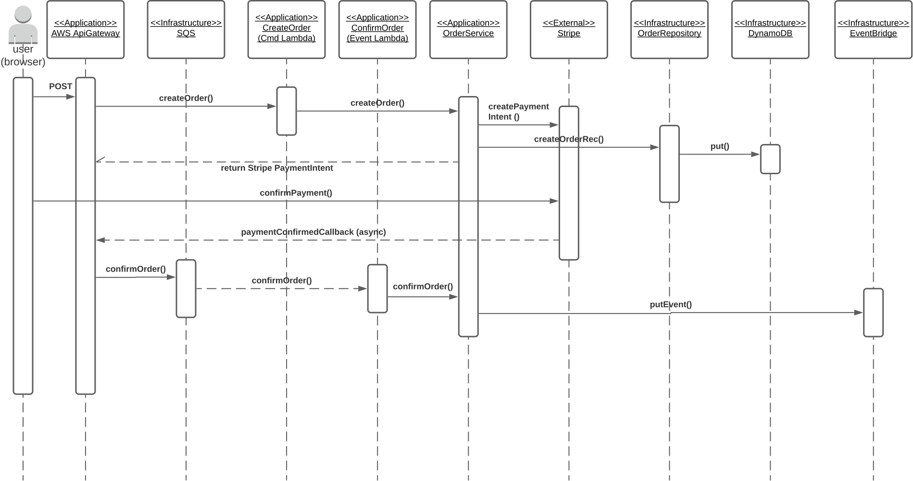

Coming soon... selecting optimal Microservice Patterns for The Better Store, with referene to the AWS Well Architected Framework and its underlying pillars concerning:
* Security
* Operational Excellence
* Reliability
* Performance
* Cost Optimization
* Sustainability 

### Application Patterns:

#####CQRS - Command Pattern

