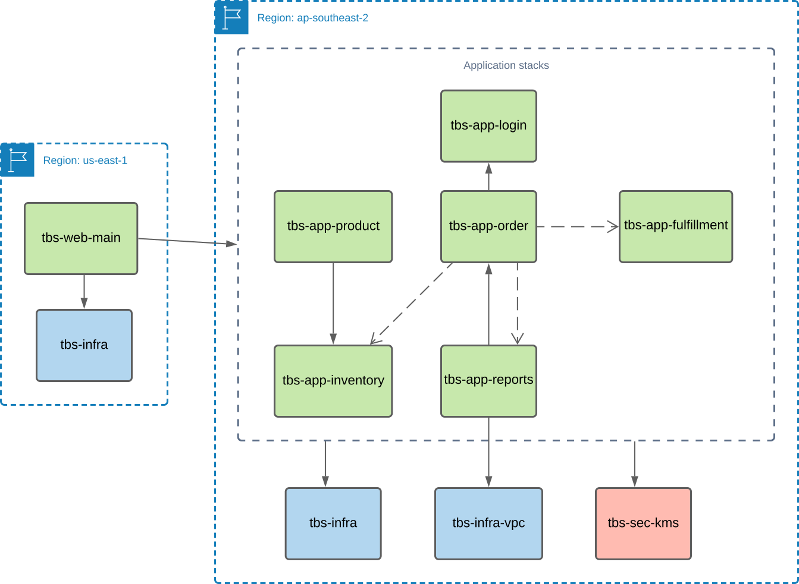

WIP

AWS Cloudformation is a popular AWS-specific Infrastructure as Code technology, and has been used for defining THe Better Store services
for its automated implementation into an AWS account.
While AWS provides a comprehensive web console that may be used by cloud engineers for defining application resources in the Cloud, 
their configurations are often complex and large, and keeping these consistent without manual error across development 
and production environments is fraught with challenges. As such, defining ALL application resources as Infrastructure as Code for deployment across 
ALL environments is very strongly recommended. There is a high learning curve associated with learning how implement Infrastructure as Code and 
AWS Cloudformation, however with practice and a gradual accumulation of previously-developed IaC to work from, this exercise quickly becomes 
productive, and massively increases the quality of releases deployed to AWS.

The following standards have been used for implementing AWS Cloudformation templates for The Better Store:
1. A single AWS Cloudformation stack is used to implement each application subdomain independently, while encapsulating all dependencies that it needs (as per the previously-described _Self-contained Service_ pattern).
2. A limited number of shared infrastructure and security stacks also exist, to define resouces such as the underlying VPC, shared KMS keys, and the domain's Route 53 Hosted Zone.
3. AWS Cloudformation stack names have the following naming standard:
   * _[system qualifier e.g. tbs]-[app|infra|sec]-[short descriptive name]-[environment]_., where:
     * infra = shared infrastructure
     * sec = shared security
     * app = application or service
   * These names align with the Git repositories where they and their specific application (if applicable) reside.
4. AWS Cloudformation stacks may provide the identifiers of the resources that they define as _Outputs_, if they may be useful to other stacks or for monitoring. Other stacks are able to reference these in their template as _Cross Stack References_.

The following diagram illustrates the stacks implemented by The Better Store:

_Figure 1: AWS Cloudformation stack hierarchy defining The Better Store's implementation. Note solid arrows define dependencies between stacks
via cross stack references, with the arrow pointing to the parent stack. Dashed-arrows highlight the direction
of events between resources in a stack; for example if a service in one stack receives messages from a service in another stack._

The following table describes each of the stacks implemented:

| **Stack name**                                                       | Description                                                                                                                                                                                                             | GitHub Repository |
|:---------------------------------------------------------------------|:------------------------------------------------------------------------------------------------------------------------------------------------------------------------------------------------------------------------|-------------------|
| tbs-infra                                                            | Defines shared reources such as Route53 Hosted Zone, API Gateway custom domain and logging resources to support applications.                                                                                           |  https://github.com/TheBetterStore/tbs-infra
| tbs-infra-vpc                                                        | Defines the VPC used, including subnets and routes. NB A separate stack for implementing the NatGateway is also included, to allow easy removal of these when not in use, for cost savings in development environments. | https://github.com/TheBetterStore/tbs-infra-vpc
| tbs-app-order                                                        | Defines the Order service and its dependencies.                                                                                                                                                                         | https://github.com/TheBetterStore/tbs-app-order
| tbs-app-fulfillment | Defines the Fulfillment service and its dependencies.                                                                                                                                                                   | https://github.com/TheBetterStore/tbs-app-fulfillment                                                                                                                                                                         