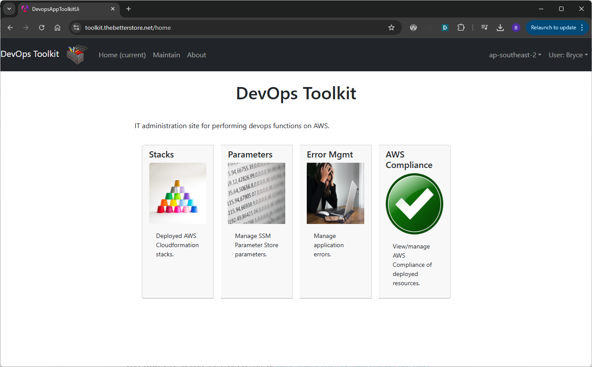
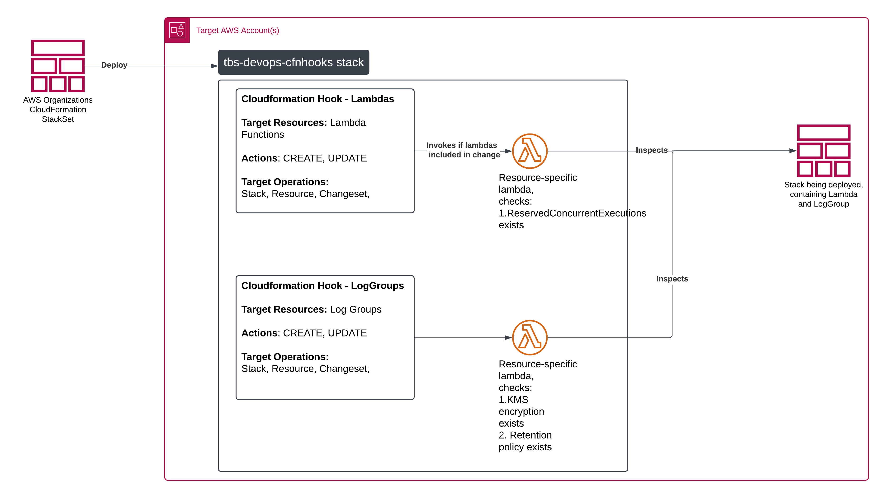

Coming soon; other supporting open-source projects under development with The Better Store. These include:

1. [DevOpsToolkit](https://github.com/TheBetterStore/tbs-devops-toolkit); a secure web-based tool which provides AWS operation
support features, including:
   1. Configuration management of deployed AWS Cloudforamtion Stacks, when parameterized with SSM Parameter Store variables.
   2. Configuration management of SSM Parameter Store variables.
   3. Cloudformation stack drift detection and visualisation.
   4. Error Management (Coming soon...)
   5. Compliance checks and monitoring/recording facilities of deployed AWS resources, based on AWS Config activity. e.g. 

2. [Cloudformation Lambda Hooks](https://github.com/TheBetterStore/tbs-devpops-cfnhooks); a sample Cloudformation stack with accompanying NodeJS code for AWS-Organization wide deployment of Lambda Cloudformation Hooks, to prevent deployment of Cloudformation stacks that do not pass compliance checks as defined in Lambda code. e.g.

