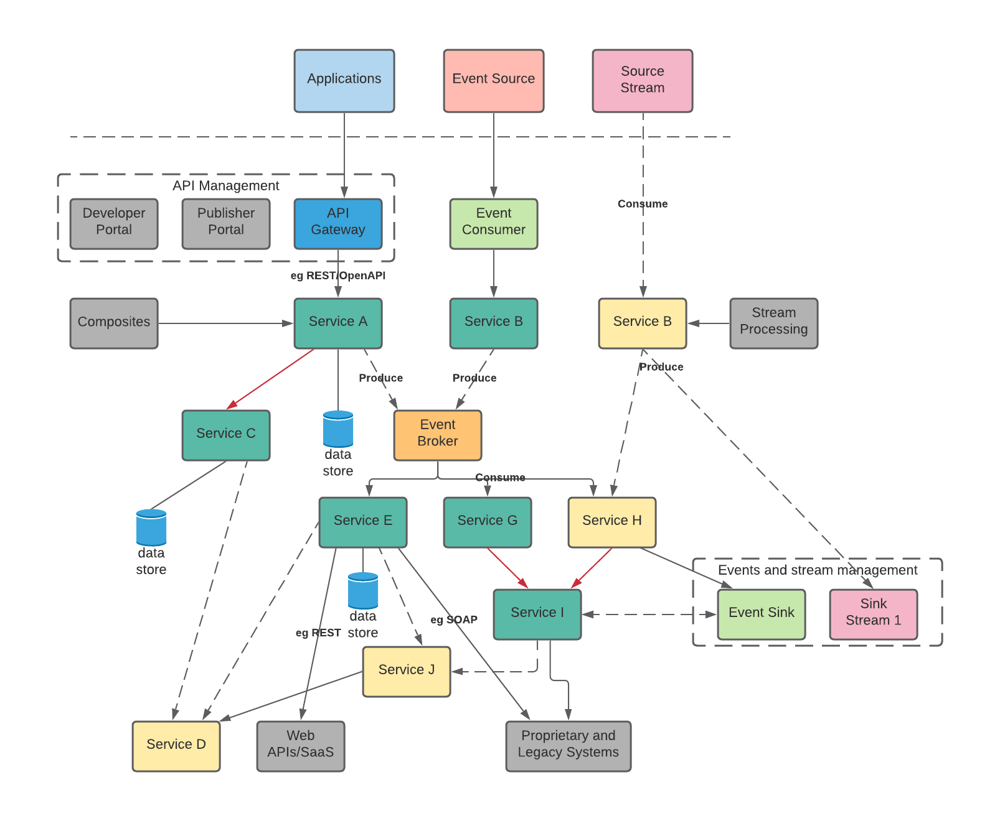

# Overview
Cloud native is building software applications as a collection of independent, loosely coupled, business-capability-oriented services (microservices) that can run on dynamic environments (public, private, hybrid, multicloud) in an automated, scalable, resilient, manageable, and observable way1.

Fig 1. A reference Microservice Architecture illustrating choice of the different common communication patterns for coupling (both loose, and tight (red)).

