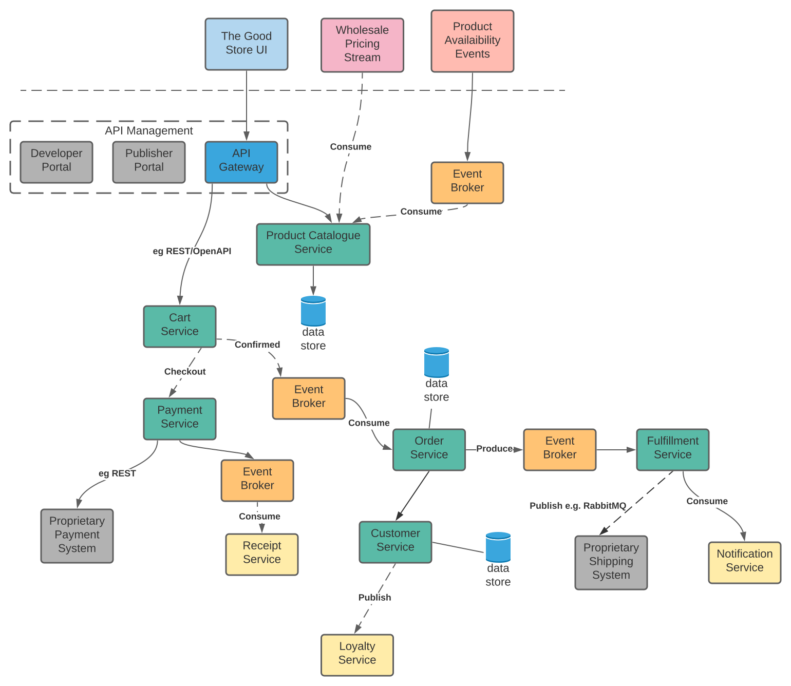

# Introducing 'The Better Store'

'The Better Store' is an Open Source project for the development of a reference Cloud-Native eCommerce platform, 
primarily as an educational tool by a team of Wellington, NZ-based software enthusiasts. It is focused on demonstrating 
the following methodologies and technologies:

### Domain Driven Design (DDD)
A design and development methodology that focuses on 'Knowledge Crunching' agile techniques between domain experts and the
technical team, for defining the business domains (entities/agregates and rules), and composing decoupled 'Bounded Contexts' 
from these. The result is a blueprint aligned to the formation of a modern Microservices Architecture (MSA), including
properties that lends well to agile change management, and services that may be extended, scaled and relied-upon within a
Cloud-Native environment. 

DDD's **_Strategic_** and **_Tactical_** patterns are described in subsequent sections.

### Cloud Native Design
Describes the attributes required by an application to run in The Cloud, for effective realization of Cloud's advantages;
including change agility, scalability, reliability, extensibility and operational cost optimization.
The following areas are discussed in relation to The Better Store, for effective implementation.
* Cloud Native attributes (12 requirements)
* Microservices Architecture
* Realizing DDD with the Onion Architecture, using NodeJS + Typescript
* DevOps Methodologies
* Polyglot Technologies
* Deployment Patterns

### AWS Services
* AWS Well Architected Framework
* Selected Services
* Implementation

## The Goal
An agile, scalable and highly-available eCommerce platform deployed on AWS based on Cloud Native design and MSA best practices. 

An initial hypothetical system is envisaged below:

The following sections look at using DDD techniques, Cloud-Native design and MSA practices to validate this at a high-level, 
and hopefully evolve the model to make the eCommerce site 'The Better Store'.
