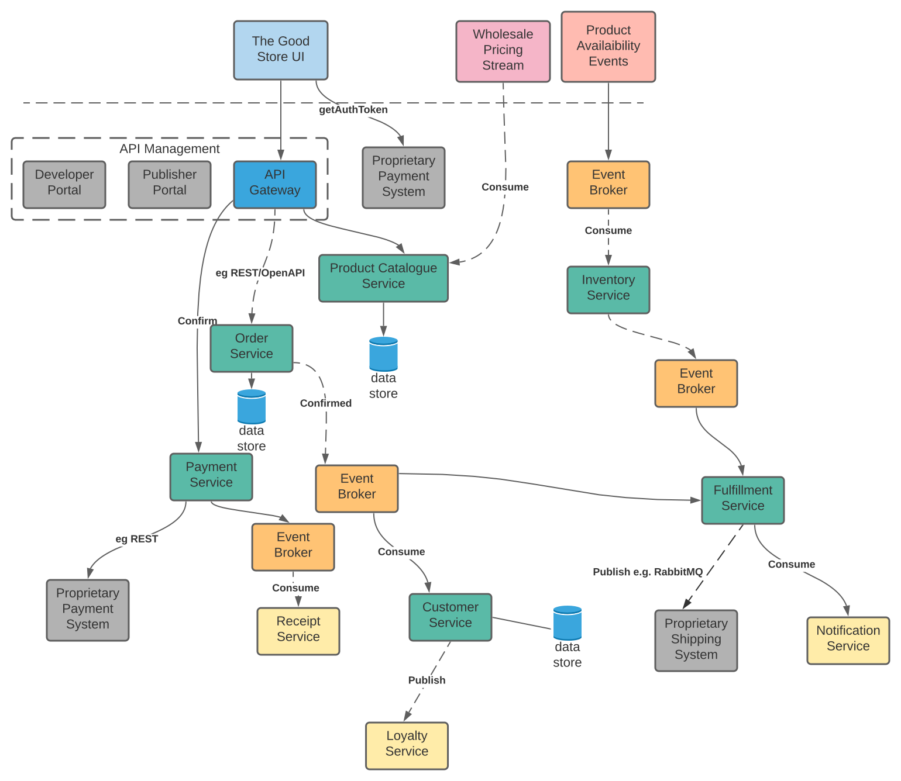

# Introducing 'The Better Store'

'The Better Store' is an Open Source project for the development of a reference Cloud-Native eCommerce platform, 
primarily as an educational tool by a team of Wellington, NZ-based software enthusiasts. It is focused on demonstrating 
the following methodologies and technologies:

### Domain Driven Design
* Strategic Patterns
* Tactical Patterns

### Cloud Native Design
* Microservices Architecture
* Realizing DDD with the Onion Architecture, using NodeJS + Typescript
* DevOps Methodologies
* Polyglot Technologies
* Deployment Patterns

### AWS Services
* AWS Well Architected Framework
* Selected Services
* Implementation

## The Goal
A scalable and highly-available eCommerce platform deployed on AWS based on Cloud Native design. Such a system
should be composed of loosely-coupled, highly-cohesive and independently-deployable microservices, that are able to 
accommodate agile change management with minimal risk using 
Infrastructure as Code and automated DevOps processes. Furthermore, such services should be fauly-tolerant and can scale 
independently on demand.

An initial hypothetical system is envisaged below:

The following sections look at using DDD techniques, Cloud-Native design and MSA practices to validate this at a high-level, 
and hopefully evolve the model to make the eCommerce site 'The Better Store'.
